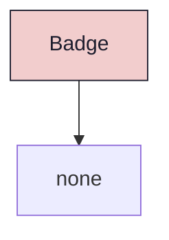

{/* Badge — Narrativ-Wahrheit. Norm: docs/doc-mdx-Norm.md. */}
import { Meta, Canvas, ArgTypes } from '@storybook/addon-docs/blocks'
import * as Stories from './Badge.stories.jsx'

<Meta of={Stories} />

## Kurzbeschreibung

Read-only Label-Pill. Kein `onClick`, kein `aria-pressed` — rein dekorativ/informativ.

## Zweck

Zeigt kompakte Metadaten an: Zählwerte (Sprints, Backlog), Identifier-Keys (Prefix), aktive Status-Labels. Abgrenzung zu `Chip`: Chip ist ein klickbares Filter-Pill (`<button>`), Badge ist ein reines ``.

## Wann verwenden

- **Ja:** Zählwerte, Prefix-Keys, Status-Labels — read-only
- **Nein:** Klickbare Filter → `Chip`; Entity-IDs (DD2-7) mit Farb-Hue → `EntityId`

## Tones

| Tone | Hintergrund | Text | Verwendung |
|------|------------|------|-----------|
| `neutral` | `surface0` | `subtext1` | Zählwerte (Sprint-Count, Backlog-Count) |
| `muted` | `surface1` | `subtext1` | Prefix-Keys (DD2, MBT) |
| `accent` | `surface1` | `accent-primary` | Aktive Sprint-Namen, Highlight-Labels |

<Canvas of={Stories.AllTones} />
<Canvas of={Stories.Neutral} />
<Canvas of={Stories.Muted} />
<Canvas of={Stories.Accent} />

## Props

<ArgTypes of={Stories} />

## Barrierefreiheit

Reines ``, keine Interaktion. Inhalt ist lesbarer Text — kein `aria-label` nötig.

## Abhängigkeiten (Komposition)

## data-ui-Anker

| Anker | Element | Zweck |
|-------|---------|-------|
| `badge` | `` | Root (Default) |
