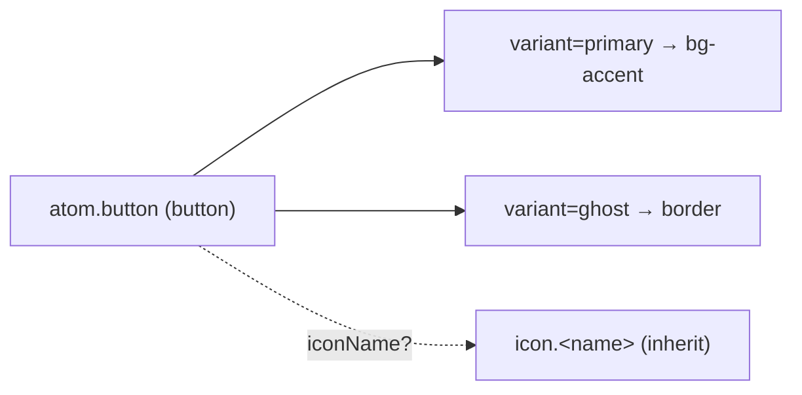

{/* Button — Narrativ-Wahrheit. Norm: docs/doc-mdx-Norm.md. */}
import { Meta, Canvas, ArgTypes } from '@storybook/addon-docs/blocks'
import * as Stories from './Button.stories.jsx'

<Meta of={Stories} />

# Button

`status:open` · Atom · Cluster `02 ATOMS/Button`

## Kurzbeschreibung

Aktions-Atom in zwei Varianten — `primary` (gefüllt, Akzent) und `ghost`
(Outline) — optional mit führendem Icon.

## Zweck

Rendert ein echtes `<button>`, damit Consumer nie ein rohes Element verwenden.
Props-driven, kein Verhalten/Store. Das optionale Icon erbt die Button-Textfarbe
(`inherit`), bleibt also auch auf der Akzentfläche kontraststark.

## Wann verwenden

- **Ja:** Form-Aktionen (Speichern/Abbrechen), Primär-Aktion einer Sektion.
- **Nein:** Icon-only-Tool → `IconButton`. Filter-Toggle → `Chip`.

## Props

<ArgTypes of={Stories} />

## Zustände

Achse `variant` (primary/ghost) + optionales Icon:

<Canvas of={Stories.Variants} />
<Canvas of={Stories.WithIcon} />

## Barrierefreiheit

### ARIA
Echtes `<button type="button">` — native Rolle/Fokus.

### Keyboard
Enter/Space lösen aus (native Button-Semantik).

## data-ui-Anker

Schema `atom.button.<story>` am `<button>`; ein etwaiges Icon trägt zusätzlich
`icon.<name>` (Icon-Registry).

