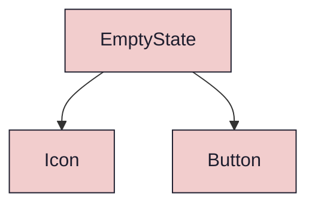
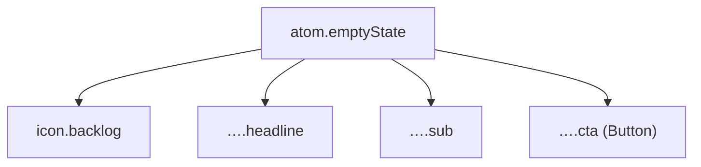

{/* EmptyState — Narrativ-Wahrheit. Norm: docs/doc-mdx-Norm.md. */}
import { Meta, Canvas, ArgTypes } from '@storybook/addon-docs/blocks'
import * as Stories from './EmptyState.stories.jsx'

<Meta of={Stories} />

# EmptyState

`status:review` · Atom · Cluster `02 ATOMS/EmptyState`

## Kurzbeschreibung

Leerzustand einer Liste in drei Varianten: `empty` (0 Elemente im Projekt),
`no-match` (Filter ergibt 0 Treffer) und `error` (Laden fehlgeschlagen). Icon +
Headline + Subtext + CTA.

## Zweck

Gibt einem leeren `ElementList` eine handlungsleitende Fläche statt einer weißen
Leere — und einem Connected-Wrapper (z.B. `RoadmapBoardConnected`) eine
Retry-Fläche bei fehlgeschlagenem Laden. Presentational, props-driven; der
CTA-Klick wird nach oben gemeldet (`onAction`). Icon über die Registry
(`backlog`/`alert`), CTA über das `Button`-Atom. Der `error`-Glyph trägt die
Danger-Rolle, die neutralen Varianten bleiben mono.

## Wann verwenden

- **Ja:** eine Liste/Tabelle hat 0 Zeilen (`empty`/`no-match`), oder ein
  Connected-Datenabruf ist fehlgeschlagen (`error`, mit Retry-`onAction`).
- **Nein:** Ladezustand → Skeleton/Spinner.

## Props

<ArgTypes of={Stories} />

## Zustände

Achse `variant`:

<Canvas of={Stories.Empty} />
<Canvas of={Stories.NoMatch} />
<Canvas of={Stories.Error} />

## Barrierefreiheit

### ARIA
Headline ist sichtbarer Text; das Icon ist dekorativ (`aria-hidden` via Icon-Default,
da Bedeutung im Text steht). Der CTA ist ein echter `Button`.

### Keyboard
Ein einziger Tab-Stop: der CTA-Button. Kein Fokus-Trap.

## Abhängigkeiten (Komposition)

{/* AUTOGEN:composition START */}

{/* AUTOGEN:composition END */}

## data-ui-Anker

