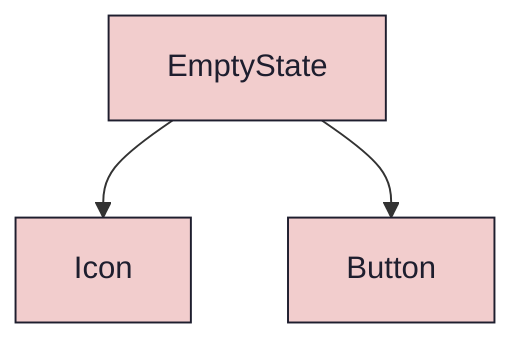
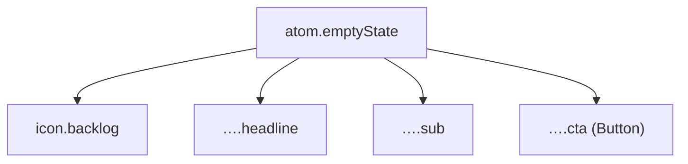

{/* EmptyState — Narrativ-Wahrheit. Norm: docs/doc-mdx-Norm.md. */}
import { Meta, Canvas, ArgTypes } from '@storybook/addon-docs/blocks'
import * as Stories from './EmptyState.stories.jsx'

<Meta of={Stories} />

# EmptyState

`status:review` · Atom · Cluster `02 ATOMS/EmptyState`

## Kurzbeschreibung

Leerzustand einer Liste in zwei Varianten (Spec §7): `empty` (0 Elemente im
Projekt) und `no-match` (Filter ergibt 0 Treffer). Icon + Headline + Subtext + CTA.

## Zweck

Gibt einem leeren `ElementList` eine handlungsleitende Fläche statt einer weißen
Leere. Presentational, props-driven; der CTA-Klick wird nach oben gemeldet
(`onAction`). Icon über die Registry (`backlog`), CTA über das `Button`-Atom.

## Wann verwenden

- **Ja:** eine Liste/Tabelle hat 0 Zeilen — projektleer oder filterleer.
- **Nein:** Ladezustand → Skeleton/Spinner. Fehlerzustand → eigener Error-Block.

## Props

<ArgTypes of={Stories} />

## Zustände

Achse `variant`:

<Canvas of={Stories.Empty} />
<Canvas of={Stories.NoMatch} />

## Barrierefreiheit

### ARIA
Headline ist sichtbarer Text; das Icon ist dekorativ (`aria-hidden` via Icon-Default,
da Bedeutung im Text steht). Der CTA ist ein echter `Button`.

### Keyboard
Ein einziger Tab-Stop: der CTA-Button. Kein Fokus-Trap.

## Abhängigkeiten (Komposition)

{/* AUTOGEN:composition START */}

{/* AUTOGEN:composition END */}

## data-ui-Anker

