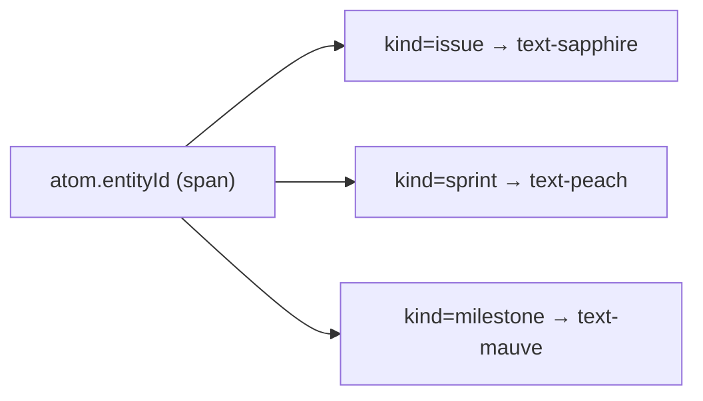

{/* EntityId — Narrativ-Wahrheit. Norm: docs/doc-mdx-Norm.md. */}
import { Meta, Canvas, ArgTypes } from '@storybook/addon-docs/blocks'
import * as Stories from './EntityId.stories.jsx'

<Meta of={Stories} />

# EntityId

`status:open` · Atom · Cluster `02 ATOMS/EntityId`

## Kurzbeschreibung

Farbcodierte Entitäts-ID (`DD2-7`, `DD#49`, `M3`). Die Farbe — nicht ein Badge —
trägt die Entität: Issue=sapphire, Sprint=peach, Milestone=mauve.

## Zweck

Reines Display-Atom, props-driven (kein Store/Fetch). Färbt seinen Text über
`foundations/entityHue.js` und erbt die Schriftgröße vom Kontext (im Tree klein,
im PageTitle groß), damit eine Kopie überall passt.

## Wann verwenden

- **Ja:** ID/Key einer Entität anzeigen (Tree, PageTitle, ListItem, Breadcrumb).
- **Nein:** Status anzeigen → `StatusDot`. Generisches Label/Tag → `Chip`.

## Props

<ArgTypes of={Stories} />

## Zustände

Achse `kind` (issue/sprint/milestone) bestimmt die Farbe; die Größe erbt vom
umgebenden Text.

<Canvas of={Stories.Kinds} />
<Canvas of={Stories.InheritsSize} />

## data-ui-Anker

Schema `atom.entityId.<story>` am Wurzel-`` (Punkt-Schema, PO-Ansprechkanal).

