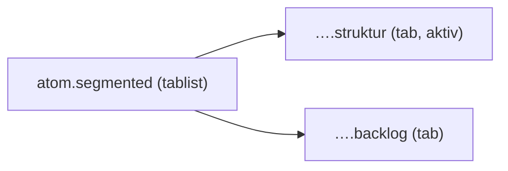

{/* SegmentedControl — Narrativ-Wahrheit. Norm: docs/doc-mdx-Norm.md. */}
import { Meta, Canvas, ArgTypes } from '@storybook/addon-docs/blocks'
import * as Stories from './SegmentedControl.stories.jsx'

<Meta of={Stories} />

# SegmentedControl

`status:open` · Atom · Cluster `02 ATOMS/SegmentedControl`

## Kurzbeschreibung

Exklusive Umschalt-Gruppe (genau eine Option aktiv) — z.B. die View-Umschaltung
Struktur ↔ Backlog im ProjectBrowser.

## Zweck

Props-driven; rendert echte `<button role="tab">`s in einer `tablist`. Jedes
Segment optional mit Icon. Der aktive Key kommt von außen (`value`), die Auswahl
wird hochgereicht (`onChange`).

## Wann verwenden

- **Ja:** 2–4 exklusive Ansichten/Modi auf engem Raum.
- **Nein:** Mehrfachauswahl → mehrere `Chip`. Einzel-Toggle → `Checkbox`.

## Props

<ArgTypes of={Stories} />

## Zustände

Achse `value` (aktives Segment):

<Canvas of={Stories.Default} />

## Barrierefreiheit

### ARIA
Container `role="tablist"`, Segmente `role="tab"` mit `aria-selected`.

### Keyboard
Segmente sind fokussierbar; Enter/Space wählen aus.

## data-ui-Anker

| Teil | data-ui | Zweck |
| --- | --- | --- |
| Gruppe | `atom.segmented.<scope>` | gesamte Umschaltung |
| Segment | `atom.segmented.<scope>.<key>` | einzelnes Segment |

