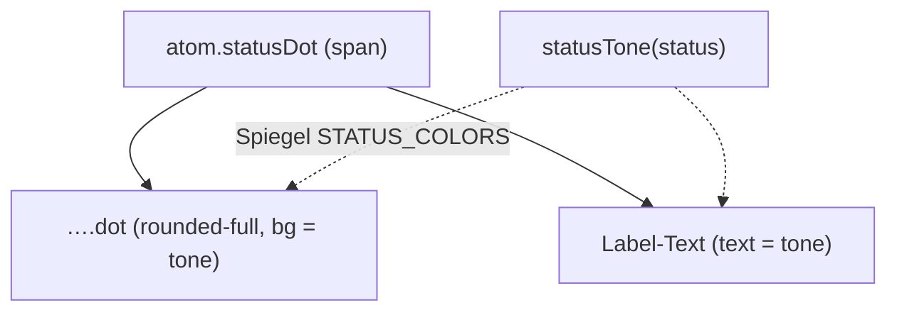

{/* StatusDot — Narrativ-Wahrheit. Norm: docs/doc-mdx-Norm.md. */}
import { Meta, Canvas, ArgTypes } from '@storybook/addon-docs/blocks'
import * as Stories from './StatusDot.stories.jsx'

<Meta of={Stories} />

# StatusDot

`status:open` · Atom · Cluster `02 ATOMS/StatusDot`

## Kurzbeschreibung

Lifecycle-Status als farbiger Punkt mit Label (`● Refined`). Der Ton kommt aus
der kanonischen Status→Farbe-Wahrheit, nicht aus einem boxed Pill.

## Zweck

Reines Display-Atom. Mappt den rohen `status`-String über
`foundations/statusTone.js` — den Spiegel von `STATUS_COLORS` aus
`apps/backend/src/lib/lifecycle.js` (PO-Entscheidung D1) — auf Catppuccin-Töne.
Funktioniert für Issue-, Sprint- und Milestone-Stati.

## Wann verwenden

- **Ja:** Status eines Issues/Sprints/Milestones anzeigen (PageTitle, ListItem).
- **Nein:** Entitäts-ID färben → `EntityId`. Auswahl-/Filter-Tag → `Chip`.

## Props

<ArgTypes of={Stories} />

## Zustände

Achse `status` — der gesamte Issue-Lifecycle, jeder Status sein kanonischer Ton.

<Canvas of={Stories.IssueLifecycle} />

## data-ui-Anker

| Teil | data-ui | Zweck |
| --- | --- | --- |
| Wurzel | `atom.statusDot.<story>` | gesamtes Label |
| Punkt | `atom.statusDot.<story>.dot` | nur der Farb-Punkt |

