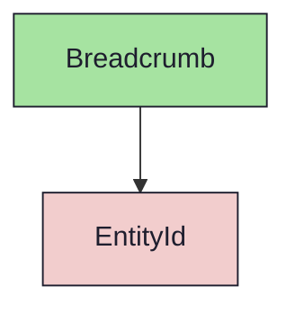
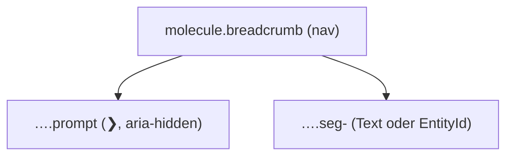

{/* Breadcrumb — Narrativ-Wahrheit. Norm: docs/doc-mdx-Norm.md. */}
import { Meta, Canvas, ArgTypes } from '@storybook/addon-docs/blocks'
import * as Stories from './Breadcrumb.stories.jsx'

<Meta of={Stories} />

# Breadcrumb

`status:open` · Molecule · Cluster `03 MOLECULES/Breadcrumb`

## Kurzbeschreibung

Pfad-Anzeige (`devd2 / DD#49 / DD2-7`) mit führendem Prompt-Zeichen `❯`. Das
letzte Segment ist hervorgehoben, Segmente sind per `/` getrennt.

## Zweck

Zeigt die Position in der Hierarchie. Default-Segmente sind Display-Text; ein
Segment mit `kind` wird über das Atom `EntityId` farbcodiert (Issue/Sprint/
Milestone). Presentational, props-driven.

## Wann verwenden

- **Ja:** Pfad-/Position-Anzeige oben in einem Screen.
- **Nein:** ganze Baum-Navigation → `TreeRow`. Einzelne ID → `EntityId`.

## Props

<ArgTypes of={Stories} />

## Zustände

Achse Segmentzahl + `last` (Hervorhebung) + optionales `kind` (EntityId-Farbe):

<Canvas of={Stories.Default} />
<Canvas of={Stories.EntityColored} />

## Barrierefreiheit

### ARIA
Wurzel ist `<nav aria-label="Breadcrumb">`; das Prompt-Zeichen ist
`aria-hidden` (rein dekorativ).

### Keyboard
Rein präsentational — keine eigenen Fokus-Stops (Links/Aktionen liegen im
Consumer).

## Abhängigkeiten (Komposition)

{/* AUTOGEN:composition START */}

{/* AUTOGEN:composition END */}

## data-ui-Anker

