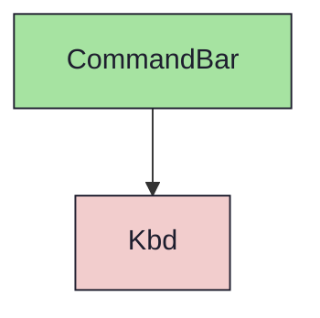
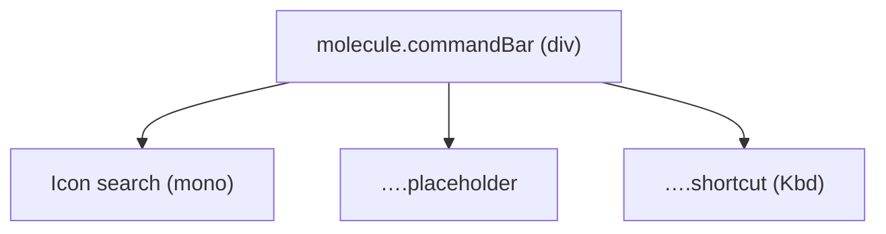

{/* CommandBar — Narrativ-Wahrheit. Norm: docs/doc-mdx-Norm.md. */}
import { Meta, Canvas, ArgTypes } from '@storybook/addon-docs/blocks'
import * as Stories from './CommandBar.stories.jsx'

<Meta of={Stories} />

# CommandBar

`status:open` · Molecule · Cluster `03 MOLECULES/CommandBar`

## Kurzbeschreibung

Such-/Command-Anzeige (presentational, kein echtes Input): führende Lupe,
Placeholder-Text und rechts ein Shortcut-Hint.

## Zweck

Reine Anzeige des Such-Einstiegs. Komponiert `Icon` (Lupe) und das Atom `Kbd`
(Shortcut-Glyphen). Der echte Such-Flow lebt im Consumer/Organism — hier nur
Optik. Props-driven.

## Wann verwenden

- **Ja:** Such-/Command-Einstieg in Topbar oder Palette-Trigger darstellen.
- **Nein:** echtes Texteingabefeld → `Input`/`FormField`.

## Props

<ArgTypes of={Stories} />

## Zustände

Achse `shortcut` (mit/ohne Kbd-Hint):

<Canvas of={Stories.Default} />
<Canvas of={Stories.ShortcutAxis} />

## Abhängigkeiten (Komposition)

{/* AUTOGEN:composition START */}

{/* AUTOGEN:composition END */}

## data-ui-Anker

