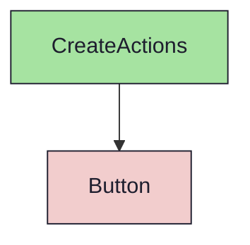

import { Meta, Canvas, ArgTypes } from '@storybook/addon-docs/blocks'
import * as Stories from './CreateActions.stories.jsx'

<Meta of={Stories} />

# CreateActions

`status:open` · Molecule · Cluster `RoadmapBoard`

## Kurzbeschreibung

Erstellen-Leiste des RoadmapBoard: drei nebeneinander stehende Buttons, je
Entität einer (Meilenstein / Sprint / Issue).

## Zweck

Presentational. Bewusst **kein** Split-/Dropdown-Button (PO 2026-06-26) — alle
drei sind gleichrangige Einstiege, weil das Board die Projekt-Zentrale ist und
die Anlage-Wege schnell erreichbar sein sollen. Seit Iteration 3 sind alle drei
**Ghost** und **gleich breit** (Container `grid grid-cols-3`, Buttons
`w-full justify-center`); Schriftgröße `size="sm"` (11px) wie die Sort-Segmente
der `BrowserToolbar`. Jeder Button feuert seinen Callback; im Mockup Spies, echte
Anlage folgt in Phase 3.

## Wann verwenden

- **Ja:** in der Toolbar-Zeile des `RoadmapBoardScreen`, rechts neben `BrowserToolbar`.
- **Nein:** einzelne Aktion irgendwo inline → direkt `Button`.

## Props

<ArgTypes of={Stories} />

## Zustände

`Default` (drei Buttons, Callbacks als Spies).

<Canvas of={Stories.Default} />

## Abhängigkeiten (Komposition)

{/* AUTOGEN:composition START */}

{/* AUTOGEN:composition END */}
