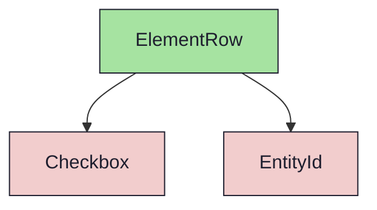
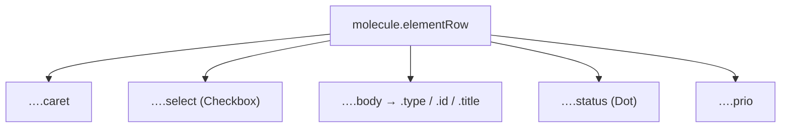

{/* ElementRow — Narrativ-Wahrheit. Norm: docs/doc-mdx-Norm.md. */}
import { Meta, Canvas, ArgTypes } from '@storybook/addon-docs/blocks'
import * as Stories from './ElementRow.stories.jsx'

<Meta of={Stories} />

# ElementRow

`status:review` · Molecule · Cluster `03 MOLECULES/ElementRow`

## Kurzbeschreibung

Eine reiche Listenzeile des ElementBrowsers (Spec §4.3/§4.4):
`[Caret] [Checkbox] [Typ-Icon] [EntityId] [Titel] [StatusDot] [Priorität]`.
Das Prio-Feld rendert nur, wenn gesetzt. (Kein Assignee — das Backend führt kein
solches Feld.)

## Zweck

Komponiert vorhandene Atoms (`Checkbox`, `Icon`, `EntityId`) zur Zeile und
übernimmt die Nesting-Optik (indent + Disclosure-Caret) aus dem `TreeRow`-Muster.
StatusDot-Farbe kommt aus `statusTone`. Presentational — Toggle-/Open-Logik liegt
im `ElementList` (Consumer).

## Wann verwenden

- **Ja:** eine Element-Zeile (Milestone/Sprint/Issue) in der Browser-Liste.
- **Nein:** reine Navigations-Hierarchie ohne Selektion/Status → `TreeRow`.

## Props

<ArgTypes of={Stories} />

## Zustände

Achsen `kind`, `caret`, `selected`/`active`, `focused` (Roving), gesetzte vs.
fehlende Priorität:

<Canvas of={Stories.IssueDefault} />
<Canvas of={Stories.Minimal} />
<Canvas of={Stories.Selected} />
<Canvas of={Stories.Focused} />
<Canvas of={Stories.NestedParents} />

## Barrierefreiheit

### ARIA
Zeile ist `role="treeitem"` mit `aria-selected`; Checkbox `role="checkbox"`,
Caret-Button `aria-expanded`. StatusDot/Prio tragen `title` für die Klartext-
Bedeutung.

### Keyboard
Zwei Modi: **standalone** (`tabbable` default) = drei Tab-Stops je Zeile (Caret,
Checkbox, Körper). **In `ElementList`** (`tabbable={false}`) sind die inneren
Controls aus dem Tab-Flow; der Listen-Container steuert per Pfeil (Roving →
`focused`-Ring), Enter (öffnen), Space (Selektion), Shift+Pfeil (Range).

## Abhängigkeiten (Komposition)

{/* AUTOGEN:composition START */}

{/* AUTOGEN:composition END */}

## data-ui-Anker

