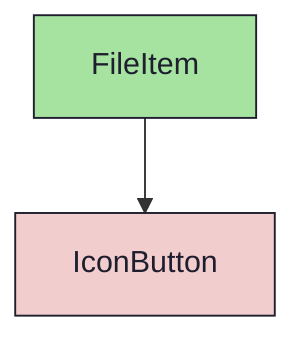
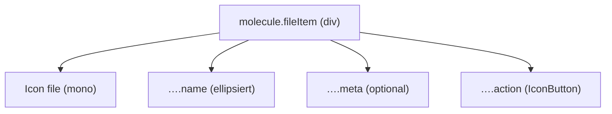

{/* FileItem — Narrativ-Wahrheit. Norm: docs/doc-mdx-Norm.md. */}
import { Meta, Canvas, ArgTypes } from '@storybook/addon-docs/blocks'
import * as Stories from './FileItem.stories.jsx'

<Meta of={Stories} />

# FileItem

`status:open` · Molecule · Cluster `03 MOLECULES/FileItem`

## Kurzbeschreibung

Kompakte Anhang-/Datei-Zeile: führendes Datei-Icon, ellipsierter Name, optionale
Meta-Angabe und rechts eine Icon-Aktion (Default: Download).

## Zweck

Eine Zeile des Anhang-Widgets. Komponiert `Icon` (führend) und das Atom
`IconButton` (Aktion) — nie ein rohes `<button>`. Presentational, props-driven;
der Klick wird über `onAction` hochgereicht.

## Wann verwenden

- **Ja:** Datei/Anhang mit Name, Meta und einer Aktion listen.
- **Nein:** generische Listenzeile → `ListItem`. Hierarchie → `TreeRow`.

## Props

<ArgTypes of={Stories} />

## Zustände

Achsen `meta` (optional) und `actionIcon`/`actionLabel` (z.B. Download vs. Öffnen);
der Name ellipsiert bei Überlänge:

<Canvas of={Stories.Default} />
<Canvas of={Stories.List} />

## Barrierefreiheit

### ARIA
Die Aktion ist ein `IconButton` mit `aria-label` (`actionLabel`) — Icon-only ist
bedeutungstragend.

### Keyboard
Der Aktions-Button ist fokussierbar; Enter/Space lösen `onAction` aus.

## Abhängigkeiten (Komposition)

{/* AUTOGEN:composition START */}

{/* AUTOGEN:composition END */}

## data-ui-Anker

