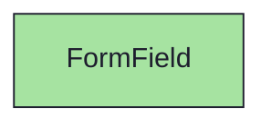
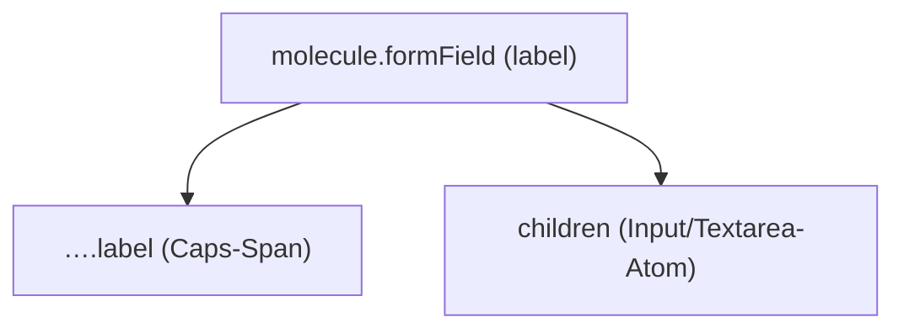

{/* FormField — Narrativ-Wahrheit. Norm: docs/doc-mdx-Norm.md. */}
import { Meta, Canvas, ArgTypes } from '@storybook/addon-docs/blocks'
import * as Stories from './FormField.stories.jsx'

<Meta of={Stories} />

# FormField

`status:open` · Molecule · Cluster `03 MOLECULES/FormField`

## Kurzbeschreibung

Betiteltes Eingabe-Wrapping: ein Display-Caps-Label über dem Eingabe-Atom
(`Input`/`Textarea`), das der Consumer als `children` reicht.

## Zweck

Rendert das `<label>` selbst (legitimes Eingabe-Wrapping) und liefert nur
Beschriftung plus vertikalen Stack — das Atom bleibt das eigentliche Feld.
Presentational, props-driven, kein Store/Fetch.

## Wann verwenden

- **Ja:** ein Formularfeld mit Label + Eingabe-Atom beschriften.
- **Nein:** reiner Lesetext mit Label → `Section`. Toggle-Block → `WidgetBase`.

## Props

<ArgTypes of={Stories} />

## Zustände

Achse `label` + das komponierte Eingabe-Atom (Input einzeilig, Textarea mehrzeilig):

<Canvas of={Stories.Default} />
<Canvas of={Stories.WithTextarea} />

## Barrierefreiheit

### ARIA
Das `<label htmlFor>` verknüpft die Beschriftung mit dem Eingabe-Atom (id),
Klick auf das Label fokussiert das Feld.

### Keyboard
Fokus/Eingabe leistet das gewrappte Atom; FormField fügt keine Tab-Stops hinzu.

## Abhängigkeiten (Komposition)

{/* AUTOGEN:composition START */}

{/* AUTOGEN:composition END */}

## data-ui-Anker

