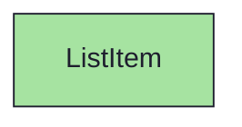
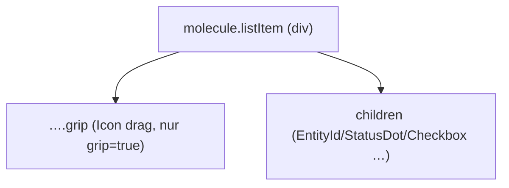

{/* ListItem — Narrativ-Wahrheit. Norm: docs/doc-mdx-Norm.md. */}
import { Meta, Canvas, ArgTypes } from '@storybook/addon-docs/blocks'
import * as Stories from './ListItem.stories.jsx'

<Meta of={Stories} />

# ListItem

`status:open` · Molecule · Cluster `03 MOLECULES/ListItem`

## Kurzbeschreibung

Generische Listenzeile (Rahmen + optionaler Drag-Grip). Der eigentliche Inhalt —
ID, Icon, Name, Status oder Checkbox — kommt als `children`.

## Zweck

Geteilte Hülle für ChildWidget- und ChecklistWidget-Zeilen. Komponiert `Icon`
(Grip); der restliche Zeileninhalt wird vom Consumer aus Atomen (`EntityId`,
`StatusDot`, `Checkbox`) zusammengesetzt. Presentational, props-driven. Das
Durchstreichen (`struck`) macht der Consumer am Namen — hier nur als
`data-struck`-Hinweis.

## Wann verwenden

- **Ja:** eine Zeile in einer sortierbaren/abhakbaren Liste.
- **Nein:** Hierarchie-Navigation → `TreeRow`. Datei-Zeile → `FileItem`.

## Props

<ArgTypes of={Stories} />

## Zustände

Achsen `grip` (Drag-Anfasser), `active` (ausgewählt → state-active), `struck`
(Durchstreich-Hinweis):

<Canvas of={Stories.Default} />
<Canvas of={Stories.Variants} />

`SprintIssueRow` ist die importierte Variante, die `SprintCard` im Wide-Mode für
`sprint.issues[]` rendert (EntityId 11px + StatusDot + truncatender Titel) — seit
Iteration 3 nutzt die Issue-Liste dieses Molecule statt eines rohen `<li>` (eine
Quelle, kein Drift).

<Canvas of={Stories.SprintIssueRow} />

## Abhängigkeiten (Komposition)

{/* AUTOGEN:composition START */}

{/* AUTOGEN:composition END */}

## data-ui-Anker

