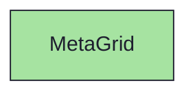
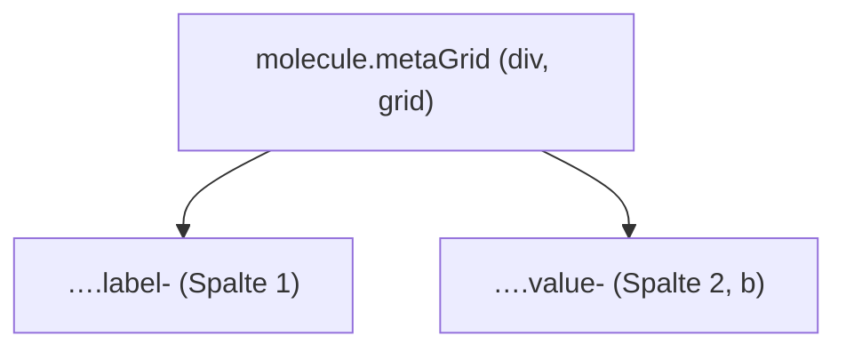

{/* MetaGrid — Narrativ-Wahrheit. Norm: docs/doc-mdx-Norm.md. */}
import { Meta, Canvas, ArgTypes } from '@storybook/addon-docs/blocks'
import * as Stories from './MetaGrid.stories.jsx'

<Meta of={Stories} />

# MetaGrid

`status:open` · Molecule · Cluster `03 MOLECULES/MetaGrid`

## Kurzbeschreibung

Zweispaltige Detail-Tabelle (Label → Wert) für die Meta-Daten eines Issues/
Sprints: Status, Priorität, Sprint, Typ.

## Zweck

Kompakte Schlüssel/Wert-Darstellung über ein `grid-cols-[auto_1fr]`. Label
gedämpft, Wert hervorgehoben. Presentational, props-driven — `rows` als Array.

## Wann verwenden

- **Ja:** mehrere Meta-Felder kompakt nebeneinanderstellen.
- **Nein:** einklappbarer Block → `WidgetBase`. Reintext → `Section`.

## Props

<ArgTypes of={Stories} />

## Zustände

Achse `rows` (Anzahl/Inhalt der Label-Wert-Paare):

<Canvas of={Stories.Default} />
<Canvas of={Stories.Compact} />

## Abhängigkeiten (Komposition)

{/* AUTOGEN:composition START */}

{/* AUTOGEN:composition END */}

## data-ui-Anker

