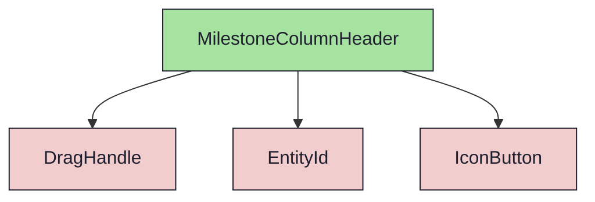

import { Meta, Canvas, ArgTypes } from '@storybook/addon-docs/blocks'
import * as Stories from './MilestoneColumnHeader.stories.jsx'

<Meta of={Stories} />

# MilestoneColumnHeader

`status:open` · Molecule · Cluster `RoadmapBoard`

## Kurzbeschreibung

Kopf einer Meilenstein-Spalte: Anfasser + farbcodierte M-ID + Name + „öffnen"-
Aktion (rechts) + Ziel; im Wide-Mode ein Detailblock.

## Zweck

Reines Molecule (props-driven). Komponiert `DragHandle` (Spalte verschieben) +
`EntityId` (kind `milestone`, mauve) + Name + rechts ein `IconButton` (`external`)
→ `onOpenMilestone` (MilestoneDetails; Mockup-Spy) + Ziel (1 Zeile, truncate).
Die DnD-Props reicht der RoadmapBoard-Container herein. Das Ziel mappt im Board
auf das Backend-Feld `description` (Milestone trägt kein `goal` — siehe Gap-Log
RoadmapBoard).

Im **Wide-Mode** (`wide`) wird das Ziel mehrzeilig gezeigt und ein Detailblock
ergänzt: Zieldatum (`target_date`) · DoD-Count (`dod_total`) · Dep-Badge
(`dependsOn` → „nach M{n}").

## Wann verwenden

- **Ja:** als Header in `MilestoneColumn`.
- **Nein:** Staging-Spalte ohne Meilenstein → `UnassignedColumnHeader`.

## Props

<ArgTypes of={Stories} />

## Zustände

`Default`, `LongName` (Name + Ziel truncaten), `DraggingState` (`grabbing`),
`Wide` (mehrzeiliges Ziel + Detailblock + Dep-Badge).

<Canvas of={Stories.Default} />
<Canvas of={Stories.LongName} />
<Canvas of={Stories.Wide} />

## Abhängigkeiten (Komposition)

{/* AUTOGEN:composition START */}

{/* AUTOGEN:composition END */}
