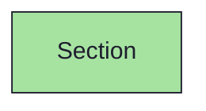
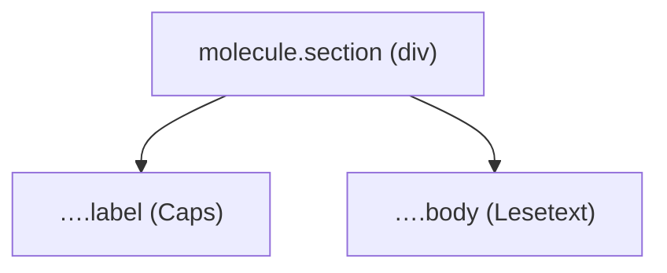

{/* Section — Narrativ-Wahrheit. Norm: docs/doc-mdx-Norm.md. */}
import { Meta, Canvas, ArgTypes } from '@storybook/addon-docs/blocks'
import * as Stories from './Section.stories.jsx'

<Meta of={Stories} />

# Section

`status:open` · Molecule · Cluster `03 MOLECULES/Section`

## Kurzbeschreibung

Betitelter Reintext-Abschnitt (Goal/Background/Description): ein Display-Caps-Label
über fließendem Lesetext.

## Zweck

Reiner Textabschnitt im TextWidget. Label und Body kommen als Props/`children` —
kein Toggle, keine Eingabe, kein Icon. Presentational, props-driven.

## Wann verwenden

- **Ja:** betitelter Lesetext-Block (Goal, Background, Description).
- **Nein:** einklappbarer Block → `WidgetBase`. Label + Eingabe → `FormField`.

## Props

<ArgTypes of={Stories} />

## Zustände

Achse `label` + Body-Länge; mehrere Abschnitte werden im Consumer gestapelt:

<Canvas of={Stories.Default} />
<Canvas of={Stories.Stack} />

## Abhängigkeiten (Komposition)

{/* AUTOGEN:composition START */}

{/* AUTOGEN:composition END */}

## data-ui-Anker

