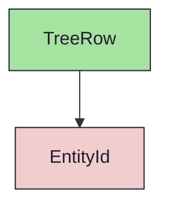
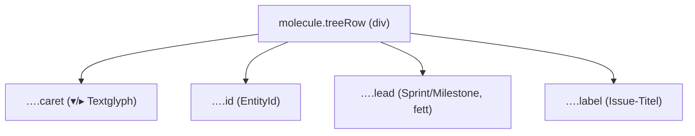

{/* TreeRow — Narrativ-Wahrheit. Norm: docs/doc-mdx-Norm.md. */}
import { Meta, Canvas, ArgTypes } from '@storybook/addon-docs/blocks'
import * as Stories from './TreeRow.stories.jsx'

<Meta of={Stories} />

# TreeRow

`status:open` · Molecule · Cluster `03 MOLECULES/TreeRow`

## Kurzbeschreibung

Eine Zeile der Navigations-Hierarchie (Milestone → Sprint → Issue): Einrückung,
auf-/zugeklappter Textcaret, farbcodierte ID, fetter Lead bzw. normaler Titel.

## Zweck

Baustein der Tree-Navigation. Komponiert das Atom `EntityId` für die ID; der
Caret ist ein Textglyph (▾/▸), kein eigener Toggle — die Klick-Logik liegt im
Consumer. Presentational, props-driven.

## Wann verwenden

- **Ja:** Zeile in einer Milestone/Sprint/Issue-Baum-Navigation.
- **Nein:** flache Listenzeile → `ListItem`. Pfad-Anzeige → `Breadcrumb`.

## Props

<ArgTypes of={Stories} />

## Zustände

Achsen `indent` (0/1/2), `caret` (open/closed/none), `idKind` (EntityId-Farbe)
und `active` (state-active):

<Canvas of={Stories.Default} />
<Canvas of={Stories.Hierarchy} />

## Abhängigkeiten (Komposition)

{/* AUTOGEN:composition START */}

{/* AUTOGEN:composition END */}

## data-ui-Anker

