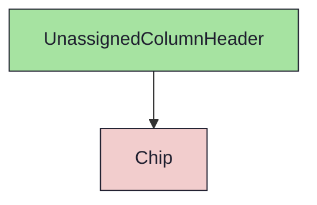

import { Meta, Canvas, ArgTypes } from '@storybook/addon-docs/blocks'
import * as Stories from './UnassignedColumnHeader.stories.jsx'

<Meta of={Stories} />

# UnassignedColumnHeader

`status:open` · Molecule · Cluster `RoadmapBoard`

## Kurzbeschreibung

Kopf der „Nicht zugeordnet"-Spalte: Titel + Sprint-Anzahl als Chip.

## Zweck

Reines Molecule (props-driven). Analog `MilestoneColumnHeader`, aber ohne
DragHandle (die Staging-Spalte ist nicht verschiebbar) und ohne Entity-ID. Der
`Chip` zeigt die Anzahl nicht zugeordneter Sprints.

## Wann verwenden

- **Ja:** als Header in `UnassignedColumn`.
- **Nein:** Meilenstein-Spalte → `MilestoneColumnHeader`.

## Props

<ArgTypes of={Stories} />

## Zustände

`Empty` (count 0), `WithCount` (count 3).

<Canvas of={Stories.WithCount} />

## Abhängigkeiten (Komposition)

{/* AUTOGEN:composition START */}

{/* AUTOGEN:composition END */}
