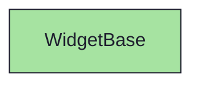
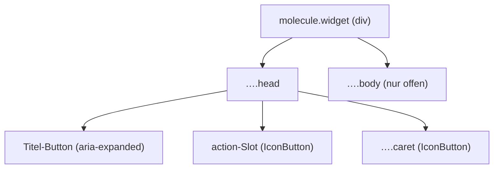

{/* WidgetBase — Narrativ-Wahrheit. Norm: docs/doc-mdx-Norm.md. */}
import { Meta, Canvas, ArgTypes } from '@storybook/addon-docs/blocks'
import * as Stories from './WidgetBase.stories.jsx'

<Meta of={Stories} />

# WidgetBase

`status:open` · Molecule · Cluster `03 MOLECULES/WidgetBase`

## Kurzbeschreibung

Accordion-Container für Content-Widgets: farbiger Kopf (Dot + Titel + Count +
Aktion + Caret), der den Body ein-/ausklappt.

## Zweck

Die geteilte Hülle aller vier Content-Widgets (Beschreibung, Anhänge, Issues,
Akzeptanzkriterien). Komponiert das Atom `IconButton` für Aktion und Caret.
Domänenfrei — Inhalt kommt als `children`, der Hue als Token-Name. Presentational:
`collapsed` kommt von außen, der Klick wird über `onToggle` hochgereicht.

## Wann verwenden

- **Ja:** ein einklappbarer, betitelter Inhaltsblock im Content-Stack.
- **Nein:** Detail-Tabelle ohne Toggle → `MetaGrid`. Reiner Text → `Section`.

## Props

<ArgTypes of={Stories} />

## Zustände

Achse `collapsed` (offen/zu), `hue` (Kopf-Ton), optionaler `count` und `action`:

<Canvas of={Stories.Default} />
<Canvas of={Stories.Collapsed} />

## Barrierefreiheit

### ARIA
Der Titel ist ein `<button aria-expanded>`; der Caret ein zweiter Toggle mit
`aria-label`. Die Aktion liegt daneben (keine verschachtelten Buttons).

### Keyboard
Titel und Caret sind fokussierbar; Enter/Space klappen um.

## Abhängigkeiten (Komposition)

{/* AUTOGEN:composition START */}

{/* AUTOGEN:composition END */}

## data-ui-Anker

| Teil | data-ui | Zweck |
| --- | --- | --- |
| Wurzel | `molecule.widget.<scope>` | gesamtes Widget |
| Kopf | `…​.head` | Kopfzeile |
| Caret | `…​.caret` | Collapse-Toggle |
| Body | `…​.body` | Inhalt (nur offen im DOM) |

