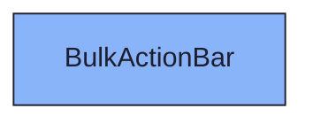
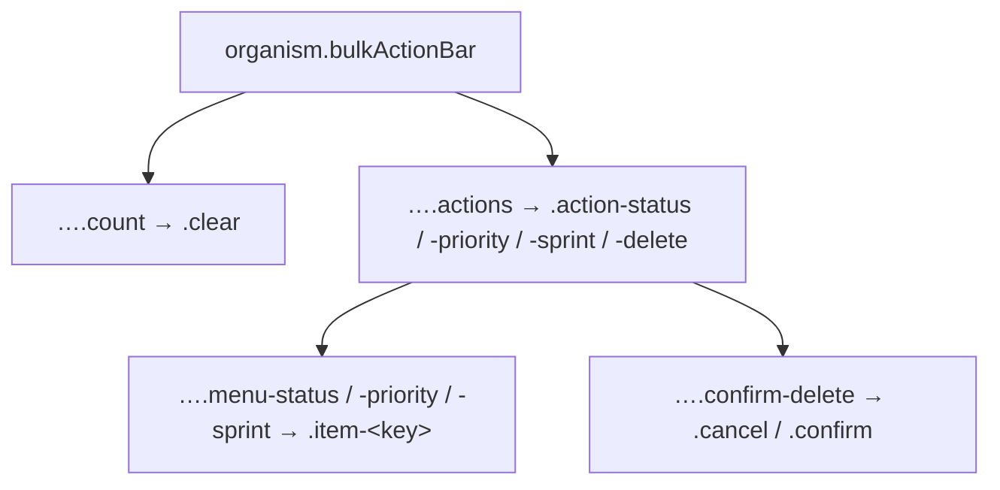

{/* BulkActionBar — Narrativ-Wahrheit. Norm: docs/doc-mdx-Norm.md. */}
import { Meta, Canvas, ArgTypes } from '@storybook/addon-docs/blocks'
import * as Stories from './BulkActionBar.stories.jsx'

<Meta of={Stories} />

# BulkActionBar

`status:review` · Organism · Cluster `04 ORGANISMS/BulkActionBar`

## Kurzbeschreibung

Fixierte Massen-Aktionsleiste (Spec §6): erscheint, sobald ≥ 1 Element selektiert
ist; slidet aus (`translateY(100%)`) wenn die Selektion leer wird. v1: Status/
Priorität/Sprint setzen + Löschen, links Auswahlzähler + „Alle aufheben".

## Zweck

Bündelt Massen-Operationen über die Selektion. Jede Aktion öffnet ihr eigenes
Popover-Menü mit den konkreten Optionen (Status-Werte, P1–P4, Sprints); Löschen
öffnet einen Bestätigungs-Dialog (Soft-Delete → `cancelled`). Welches Menü offen
ist, hält die Bar selbst; die Auswahl meldet sie als `onAction(action, value)`
nach oben. Stories setzen `openAction`, um die Menüs als Snapshot zu zeigen.

## Wann verwenden

- **Ja:** untere Zone des ElementBrowsers bei aktiver Selektion.
- **Nein:** Einzel-Element-Aktionen → Aktionen im Detail-Panel.

## Props

<ArgTypes of={Stories} />

## Zustände

Achse Sichtbarkeit (Selektion > 0):

<Canvas of={Stories.Visible} />
<Canvas of={Stories.Hidden} />

Achse offenes Aktionsmenü (`openAction`) — je Bulk-Aktion ein Menü:

<Canvas of={Stories.StatusMenu} />
<Canvas of={Stories.PriorityMenu} />
<Canvas of={Stories.SprintMenu} />
<Canvas of={Stories.DeleteConfirm} />

## Barrierefreiheit

### ARIA
Leiste ist `role="toolbar"`; im leeren Zustand `aria-hidden`. Aktions-Trigger
tragen `aria-haspopup` (`menu` bzw. `dialog`) + `aria-expanded`; die Menüs sind
`role="menu"`/`menuitem`, der Lösch-Dialog `role="alertdialog"`. Löschen ist
danger-getönt (Token, nicht nur Farbe — Label trägt die Bedeutung).

### Keyboard
Tab erreicht die Leiste (Feedback-Kette: in der Liste markieren → Tab → Bulk).
Tab-Reihenfolge: „Alle aufheben" → Status → Priorität → Sprint → Löschen.
`Enter`/`Space` öffnet das Menü des fokussierten Triggers, `Pfeil ↑/↓` rovet durch
die Optionen, `Enter`/`Space` wählt, `Escape` schließt das offene Menü.

> **Integrations-Hinweis:** `delete` mappt auf den Backend-Bulk `cancel`
> (DD-524, Soft-Delete = cancelled-Status); `status`/`sprint` auf `set_status`/
> `set_sprint`. **`priority` hat KEINEN Backend-Bulk-Endpunkt** —
> `elementsApi.bulkUpdateIssues` wirft dafür bewusst; das Priorität-Menü trägt
> den Hinweis, bis `set_priority` serverseitig nachgerüstet ist (I01).

## Abhängigkeiten (Komposition)

{/* AUTOGEN:composition START */}

{/* AUTOGEN:composition END */}

## data-ui-Anker

