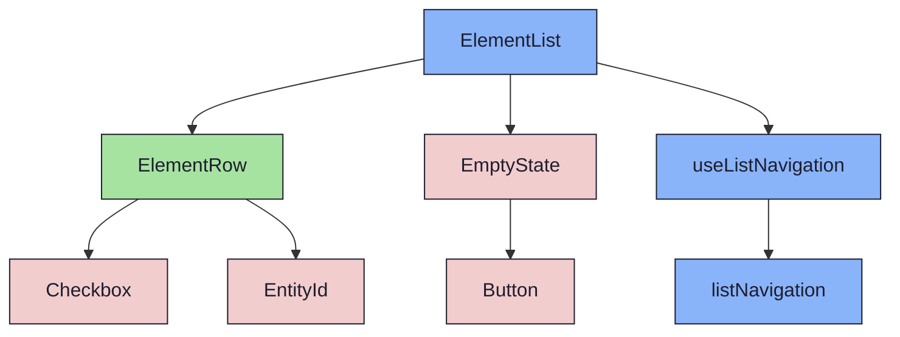
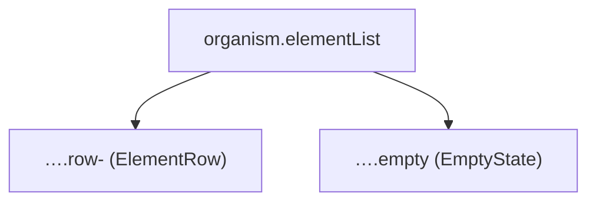

{/* ElementList — Narrativ-Wahrheit. Norm: docs/doc-mdx-Norm.md. */}
import { Meta, Canvas, ArgTypes } from '@storybook/addon-docs/blocks'
import * as Stories from './ElementList.stories.jsx'

<Meta of={Stories} />

# ElementList

`status:review` · Organism · Cluster `04 ORGANISMS/ElementList`

## Kurzbeschreibung

Scrollbarer Listen-Organismus (Spec §4): rendert `ElementRow[]`, bis zu drei Ebenen
verschachtelt (Milestone > Sprint > Issue) via Disclosure. Leerer Zustand delegiert
an `EmptyState` (Spec §7).

## Zweck

Bündelt Zeilen-Rendering + Nesting-Walk + Leerzustand an einer Stelle.
Presentational: Expand-/Selektions-Zustand kommt als Props rein, Toggles meldet
die Liste nach oben. Bei `Typ=Issue` (flache Daten) entfällt Nesting automatisch.

## Wann verwenden

- **Ja:** die mittlere Listen-Zone des ElementBrowsers.
- **Nein:** Detailansicht eines Elements → `ListItemPreview` + Detail-Organismus.

## Props

<ArgTypes of={Stories} />

## Zustände

Achsen flach/verschachtelt + EmptyState-Varianten:

<Canvas of={Stories.Flat} />
<Canvas of={Stories.Nested} />
<Canvas of={Stories.Empty} />
<Canvas of={Stories.NoMatch} />

## Barrierefreiheit

### ARIA
APG-Tree-Muster: `role="tree"` am Container, `tabIndex=0` als einziger Tab-Stop,
`aria-activedescendant` verweist auf die aktive Zeile. Zeilen-Controls `tabIndex=-1`.

### Keyboard
Pfeil ↑/↓ bewegt den Roving-Cursor (`useListNavigation`), Shift+Pfeil Range,
Enter öffnet, Space toggelt Selektion. Ein Tab verlässt die Liste.

### Focus-Ring-Pattern (Best Practice)

Der Container (`role="tree"`) ist fokussierbar, darf aber **keinen eigenen Ring** zeigen —
der Roving-Ring auf der aktiven `ElementRow` (`ring-2 ring-[var(--accent-primary)] ring-inset`)
trägt die gesamte visuelle Affordanz.

**Warum die globale `*:focus-visible`-Regel (DD-97) ohne Override gewinnt:**
Tailwind-Utilities liegen in `@layer utilities`; die globale Regel steht *unlayered* (nach
`@import "tailwindcss"`). Unlayered schlägt layered — Spezifität ist irrelevant. Damit
versagt jede Tailwind-Utility-Lösung (`outline-none`, `focus-visible:outline-none`,
`focus-visible:[outline:none!important]`).

**Lösung:** ebenfalls unlayered, höhere Spezifität, spätere Quellreihenfolge in `index.css`:

```css
/* DD-97 Scope-Override — beats *:focus-visible (same layer, attr-selector wins) */
[role="tree"]:focus-visible { outline: none; }
```

Auf diese Weise entfällt jede Klasse am Container; DD-97 (Peach-Outline für echte
Tab-Navigation) bleibt für alle anderen Elemente unberührt.

## Abhängigkeiten (Komposition)

{/* AUTOGEN:composition START */}

{/* AUTOGEN:composition END */}

## data-ui-Anker


