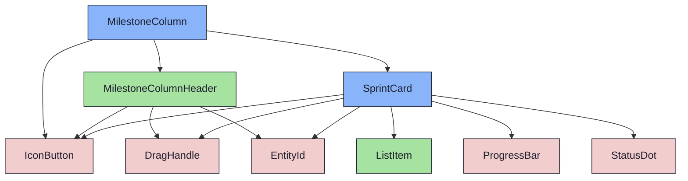

import { Meta, Canvas, ArgTypes } from '@storybook/addon-docs/blocks'
import * as Stories from './MilestoneColumn.stories.jsx'

<Meta of={Stories} />

# MilestoneColumn

`status:open` · Organism (base) · Cluster `RoadmapBoard`

## Kurzbeschreibung

Eine Meilenstein-Spalte: Header (verschiebbar) + Liste aktiver SprintCards
(Drop-Ziel) + collapsbare „Abgeschlossen"-Sektion am Fuß.

## Zweck

Presentational. Komponiert `MilestoneColumnHeader` (mit Divider abgesetzt) +
aktive `SprintCard`s + `CompletedSprintList` (lokaler Toggle, initial eingeklappt
— Q04). DnD ist NICHT hier verdrahtet: der Container reicht Spalten-Drag
(`dragHandleProps`/`dragRef`), Body-Drop (`droppableRef`/`isOver`) und Card-Drag
(`CardComponent` = Draggable-Wrapper) herein. So bleibt die Spalte in Storybook
ohne Container per Props darstellbar.

Material: **WidgetBase-Sprache** (`mantle`-Background + `--border` + Header-Divider)
statt der früheren `layer-2/surface0`-Tokens — einheitliche Optik mit den Widgets
(Iteration 2). Im **Wide-Mode** (`wide`) verdoppelt sich die Spaltenbreite und
Header/Cards blenden ihre Detailblöcke ein; `dependsOn` speist das Dep-Badge im
Header.

## Wann verwenden

- **Ja:** je Meilenstein im `RoadmapBoard`.
- **Nein:** Staging ohne Meilenstein → `UnassignedColumn`.

## Props

<ArgTypes of={Stories} />

## Zustände

`WithSprints`, `Empty` (Hinweis statt Cards), `WithCompleted` (Sektion aufgeklappt),
`IsOver` (Drop-Highlight: Border + Body-Tönung), `Wide` (doppelte Breite +
Detailblöcke + Dep-Badge).

<Canvas of={Stories.WithSprints} />
<Canvas of={Stories.WithCompleted} />
<Canvas of={Stories.IsOver} />
<Canvas of={Stories.Wide} />

## Barrierefreiheit

### ARIA

`role="group"` mit `aria-label={milestone.name}`. Completed-Toggle ist ein
`IconButton` mit `aria-pressed`.

## Abhängigkeiten (Komposition)

{/* AUTOGEN:composition START */}

{/* AUTOGEN:composition END */}
