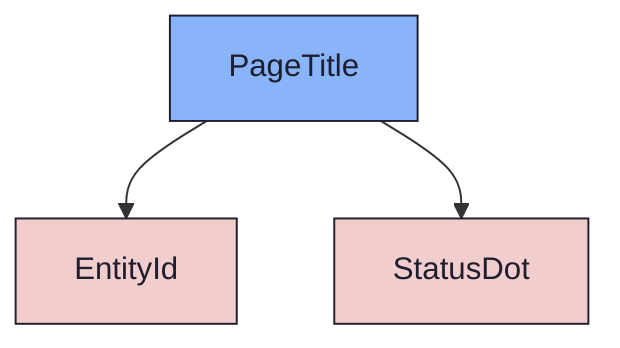
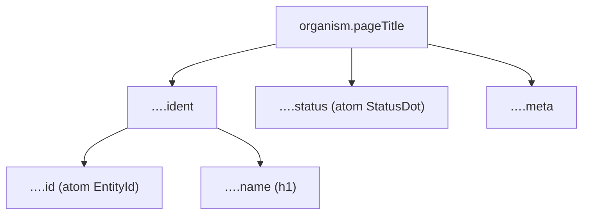

{/* PageTitle — Narrativ-Wahrheit. Norm: docs/doc-mdx-Norm.md. */}
import { Meta, Canvas, ArgTypes } from '@storybook/addon-docs/blocks'
import * as Stories from './PageTitle.stories.jsx'

<Meta of={Stories} />

# PageTitle

`status:open` · Organism · Cluster `04 ORGANISMS/PageTitle`

## Kurzbeschreibung

Lead-Panel eines Detail-Screens: farbcodierter Key + Bezeichner links, Lifecycle-
Status rechts, darunter eine Meta-Zeile (Typ · Prio · …).

## Zweck

Domänenfreier Organism, der die Atome `EntityId` (Key) und `StatusDot` (Status)
komponiert. Trägt dasselbe Material wie die Widgets (mantle + Border + radius),
damit er sich flach in den Content-Stack einfügt. Die drei Detail-Screens
(Issue/Sprint/Milestone) füllen ihn mit ihren Fixture-Daten.

## Wann verwenden

- **Ja:** Kopf eines Detail-Screens über dem Widget-Stack.
- **Nein:** Zeile in einer Liste → `ListItem`/`TreeRow`. Reines Status-Label → `StatusDot`.

## Props

<ArgTypes of={Stories} />

## Zustände

Achsen `kind` (Key-Farbe) und `status` (Ton) — je Entität:

<Canvas of={Stories.PerEntity} />

## Abhängigkeiten (Komposition)

{/* AUTOGEN:composition START */}

{/* AUTOGEN:composition END */}

## data-ui-Anker

| Teil | data-ui | Zweck |
| --- | --- | --- |
| Wurzel | `organism.pageTitle.<scope>` | Lead-Panel |
| Ident | `…​.ident` | Key + Name |
| Key | `…​.id` | EntityId |
| Name | `…​.name` | Bezeichner (h1) |
| Status | `…​.status` | StatusDot |
| Meta | `…​.meta` | Meta-Zeile |

