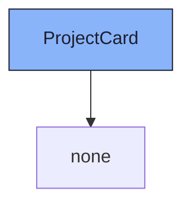

{/* ProjectCard — Narrativ-Wahrheit. Norm: docs/doc-mdx-Norm.md. */}
import { Meta, Canvas } from '@storybook/addon-docs/blocks'
import * as Stories from './ProjectCard.stories.jsx'

<Meta of={Stories} />

## Kurzbeschreibung

Einzel-Projekt-Karte für den ToolHome-Grid. Vollständig als `<button>` — gesamte Card + „Öffnen"-CTA triggern `onSelect(slug)`.

## Zweck

Zeigt Projekt-Überblick (Prefix, Name, optionale Description, Sprint+Backlog-Counts, aktiver Sprint). Farbakzent oben via Catppuccin-Token (`var(--ctp-<color>)`).

## Zustände

| Story | Trigger | Was gezeigt wird |
|-------|---------|-----------------|
| Default | — | Vollständige Daten, aktiver Sprint |
| KeinAktiverSprint | `active_sprint: null` | Kein ActiveSprintChip |
| MinimalDaten | Nur Pflichtfelder | Kein Description, 0 Counts |
| LangerName | Name > Kartenbreite | `truncate`-Verhalten |

<Canvas of={Stories.Default} />
<Canvas of={Stories.KeinAktiverSprint} />
<Canvas of={Stories.MinimalDaten} />
<Canvas of={Stories.LangerName} />

## Props

| Prop | Typ | Default | Beschreibung |
|------|-----|---------|-------------|
| `project` | `Project` | — | Pflicht. Enthält `id`, `slug`, `name`, `prefix`, `color`, `archived` |
| `onSelect` | `(slug) => void` | — | Pflicht. Wird bei Klick auf Card oder CTA aufgerufen |
| `dataUiScope` | `string` | `'organism.projectCard'` | Root-Attribut für Playwright/QA |

## Barrierefreiheit

- Card ist `<button type="button">` — kein `div + onClick`
- `aria-label` trägt vollständigen Screenreader-Text (Prefix, Name, Counts, aktiver Sprint)
- `Öffnen →`-Span ist `aria-hidden="true"` (redundant mit aria-label)
- `focus-visible:outline` auf Card mit `outline-offset-2`

## Abhängigkeiten (Komposition)

{/* AUTOGEN:composition START */}

{/* AUTOGEN:composition END */}

## data-ui-Anker

| Anker | Element | Zweck |
|-------|---------|-------|
| `organism.projectCard` | `<button>` | Root |
| `organism.projectCard.accent` | `
` | Farbbalken |
| `organism.projectCard.header` | `
` | Prefix + Name |
| `organism.projectCard.prefix` | `` | PrefixBadge |
| `organism.projectCard.name` | `` | Projektname |
| `organism.projectCard.description` | `
` | Beschreibung (bedingt) |
| `organism.projectCard.meta` | `
` | Sprint · Backlog · Sprint-Chip |
| `organism.projectCard.active-sprint` | `` | ActiveSprintChip (bedingt) |
| `organism.projectCard.footer` | `
` | Öffnen-CTA |
| `organism.projectCard.cta` | `` | „Öffnen →" (aria-hidden) |
