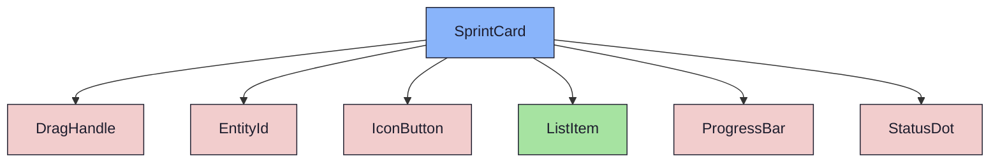

import { Meta, Canvas, ArgTypes } from '@storybook/addon-docs/blocks'
import * as Stories from './SprintCard.stories.jsx'

<Meta of={Stories} />

# SprintCard

`status:open` · Organism (base) · Cluster `RoadmapBoard`

## Kurzbeschreibung

Sprint als Board-Card. Zwei Varianten in EINER Komponente (D04): `active`
(ziehbar, mit Fortschritt) und `completed` (reduziert, read-only).

## Zweck

Presentational. `active` komponiert `EntityId` + `StatusDot` + Name (klickbar →
`onOpen`) + `ProgressBar` + `DragHandle`; der DragHandle ist der einzige
Drag-Trigger, damit die Body-Navigation klickbar bleibt. `completed` ist kompakt,
muted, einzeilig — kein Handle, kein ProgressBar (implizit fertig). DnD-Props
(`dragHandleProps`/`dragRef`/`isDragging`) reicht der RoadmapBoard-Container herein.

Im **Wide-Mode** (`wide`) zeigt `active` zusätzlich eine Detailzeile (Issue-Count
+ stornierte) mit einem Chevron (lokaler State, initial eingeklappt), der die
Issue-Liste (`sprint.issues[]`: EntityId + StatusDot + Titel) aufklappt — analog
dem `CompletedSprintList`-Toggle. Die Issue-Zeilen komponieren seit Iteration 3
das `ListItem`-Molecule (statt rohem `<li>`), damit sie dem normalen
Listen-Layout folgen — Story dort: `SprintIssueRow`.

## Wann verwenden

- **Ja:** Sprint-Eintrag in MilestoneColumn / UnassignedColumn.
- **Nein:** Sprint-Detail-Header → `PageTitle`. Backlog-Issue-Zeile → `ElementRow`.

## Props

<ArgTypes of={Stories} />

## Zustände

`Active`, `Review` (anderer StatusDot), `Dragging` (Ghost-Optik), `Completed`
(reduzierte Variante), `Wide` (Detailzeile + Issue-Chevron).

<Canvas of={Stories.Active} />
<Canvas of={Stories.Completed} />
<Canvas of={Stories.Wide} />

## Barrierefreiheit

### ARIA

`role="article"` mit `aria-label="Sprint <id>: <name>"`. ProgressBar trägt seine
eigene `progressbar`-Rolle. DragHandle hat ein eigenes `aria-label`.

## Abhängigkeiten (Komposition)

{/* AUTOGEN:composition START */}

{/* AUTOGEN:composition END */}
