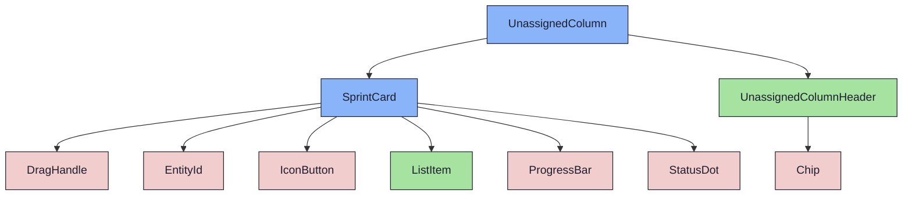

import { Meta, Canvas, ArgTypes } from '@storybook/addon-docs/blocks'
import * as Stories from './UnassignedColumn.stories.jsx'

<Meta of={Stories} />

# UnassignedColumn

`status:open` · Organism (base) · Cluster `RoadmapBoard`

## Kurzbeschreibung

Staging-Spalte für Sprints ohne Meilenstein. Rechtes Ende des RoadmapBoard (D05),
optisch abgesetzt: layer-3 + gestrichelte Border (Q03).

## Zweck

Presentational, analog `MilestoneColumn`, aber ohne DragHandle (nicht
verschiebbar) und ohne „Abgeschlossen"-Bereich. Drop-Ziel-Verdrahtung
(`droppableRef`/`isOver`) und Card-Drag (`CardComponent`) kommen vom Container.

## Wann verwenden

- **Ja:** als feste letzte Spalte im `RoadmapBoard` (Sprint-Staging).
- **Nein:** Meilenstein-Spalte → `MilestoneColumn`.

## Props

<ArgTypes of={Stories} />

## Zustände

`WithSprints`, `Empty` („Alle Sprints zugeordnet"), `IsOver` (Drop-Highlight).

<Canvas of={Stories.WithSprints} />
<Canvas of={Stories.IsOver} />

## Barrierefreiheit

### ARIA

`role="group"` mit `aria-label="Nicht zugeordnet"`.

## Abhängigkeiten (Komposition)

{/* AUTOGEN:composition START */}

{/* AUTOGEN:composition END */}
