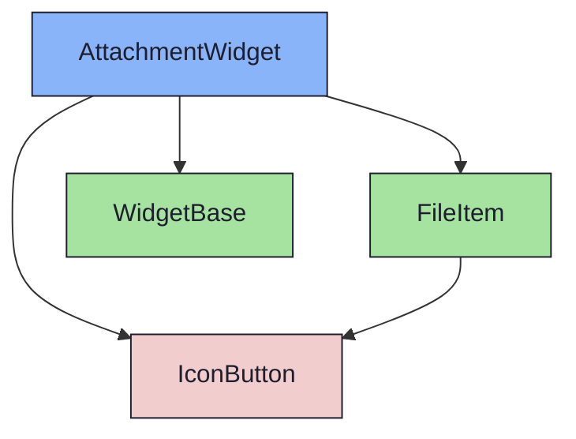
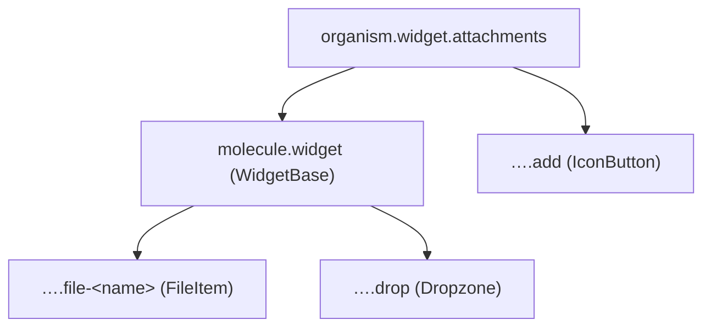

{/* AttachmentWidget — Narrativ-Wahrheit. Norm: docs/doc-mdx-Norm.md. */}
import { Meta, Canvas, ArgTypes } from '@storybook/addon-docs/blocks'
import * as Stories from './AttachmentWidget.stories.jsx'

<Meta of={Stories} />

# AttachmentWidget

`status:open` · Organism · Cluster `04 ORGANISMS/AttachmentWidget`

## Kurzbeschreibung

Datei-Anhänge: Stack aus `FileItem`s, Dropzone am Boden zum Hinzufügen.

## Zweck

Konkreter Content-Organism. Komponiert `WidgetBase` + `FileItem` (Molecule) +
`IconButton` (Hinzufügen) + `Icon` (Dropzone). Presentational, props-driven.
Halbe Breite im Detail-Grid.

## Wann verwenden

- **Ja:** Datei-Anhänge eines Issues anzeigen/hochladen.
- **Nein:** Freitext → `TextWidget`. Kriterien → `ChecklistWidget`.

## Props

<ArgTypes of={Stories} />

## Zustände

Achse `files` (befüllt/leer) und `collapsed`:

<Canvas of={Stories.Default} />
<Canvas of={Stories.Empty} />

## Abhängigkeiten (Komposition)

{/* AUTOGEN:composition START */}

{/* AUTOGEN:composition END */}

## data-ui-Anker

