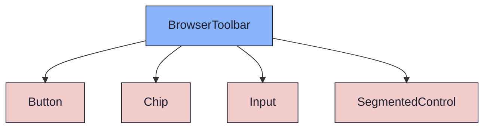
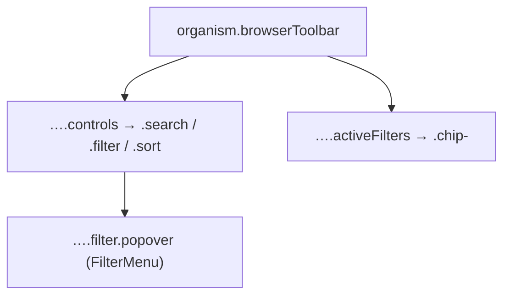

{/* BrowserToolbar — Narrativ-Wahrheit. Norm: docs/doc-mdx-Norm.md. */}
import { Meta, Canvas, ArgTypes } from '@storybook/addon-docs/blocks'
import * as Stories from './BrowserToolbar.stories.jsx'

<Meta of={Stories} />

# BrowserToolbar

`status:review` · Organism · Cluster `04 ORGANISMS/BrowserToolbar`

## Kurzbeschreibung

Kopfzeile des ElementBrowsers (Spec §3): Suche + Filter-Trigger + Sort in einer
Steuerzeile, darunter die Aktiv-Filter-Chip-Zeile (FilterBar-Rolle). Der Filter-
Trigger öffnet das bestehende `FilterMenu` als anker-loses Popover (D02).

## Zweck

Bündelt die drei Listen-Steuerungen ohne ein zweites Filter-UI zu erfinden —
`FilterMenu` (Typ/Prio/Zeitraum + erweiterte Status/Sprint-Gruppen) wird
wiederverwendet. Weil ein Organismus orchestriert wird, liegt das Bauteil in
`organisms/complex`. Such-Atom `Input` ohne Icon-Slot → führendes `search`-Icon
per Wrapper. Presentational, props-driven.

## Wann verwenden

- **Ja:** obere Zone des ElementBrowsers (Backlog/SprintReview teilen sie).
- **Nein:** ein einzelnes Filter-Panel ohne Suche/Sort → direkt `FilterMenu`.

## Props

<ArgTypes of={Stories} />

## Zustände

Achsen aktive Filter (FilterBar) + FilterMenu-Popover offen/zu:

<Canvas of={Stories.Default} />
<Canvas of={Stories.WithActiveFilters} />
<Canvas of={Stories.FilterOpen} />

## Barrierefreiheit

### ARIA
Such-`Input` ist in ein `<label>` gewickelt. Der Filter-Trigger trägt
`aria-expanded`. Sort ist ein `role="tablist"` (aus `SegmentedControl`).

### Keyboard
Tab: Suche → Filter-Trigger → Sort-Segmente → Aktiv-Filter-Chips. `/`/`Cmd+F`-
Fokus auf die Suche ist Shortcut-Verhalten des Wrappers (Spec §8), nicht des Mockups.

## Abhängigkeiten (Komposition)

{/* AUTOGEN:composition START */}

{/* AUTOGEN:composition END */}

## data-ui-Anker

