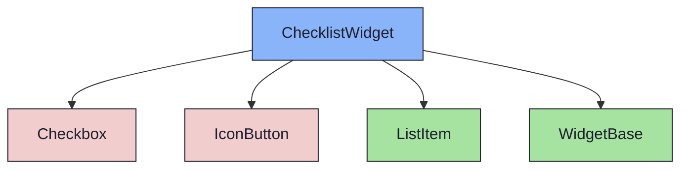
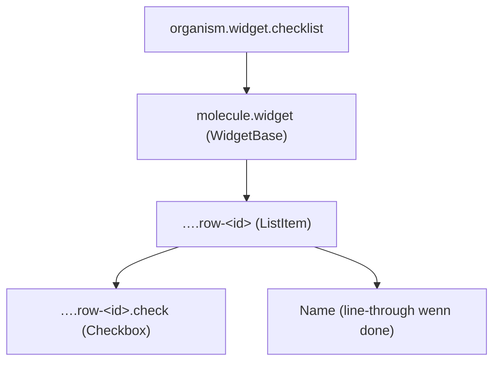

{/* ChecklistWidget — Narrativ-Wahrheit. Norm: docs/doc-mdx-Norm.md. */}
import { Meta, Canvas, ArgTypes } from '@storybook/addon-docs/blocks'
import * as Stories from './ChecklistWidget.stories.jsx'

<Meta of={Stories} />

# ChecklistWidget

`status:open` · Organism · Cluster `04 ORGANISMS/ChecklistWidget`

## Kurzbeschreibung

Abhakbare Kriterien (Akzeptanzkriterien / DoD-Items) — volle Breite im Content-Grid.

## Zweck

Konkreter Content-Organism. Komponiert `WidgetBase` + `ListItem` (Molecule) +
`Checkbox` + `IconButton` (Atome). Items sind auf `{id, name, done}` normalisiert
(Issue-Subtask `open|done` bzw. Milestone-DoD `done:0|1`). Erledigte Zeilen sind
durchgestrichen; der Count zeigt die offenen.

## Wann verwenden

- **Ja:** Akzeptanzkriterien eines Issues, Definition-of-Done eines Milestones.
- **Nein:** Kind-Issues mit Status → `ChildWidget`. Freitext → `TextWidget`.

## Props

<ArgTypes of={Stories} />

## Zustände

Achse `collapsed`; Zeilen offen/abgehakt (Checkbox + Durchstreichen):

<Canvas of={Stories.Default} />

## Barrierefreiheit

### ARIA
Jede Zeile enthält das Atom `Checkbox` (`role="checkbox"`, `aria-checked`).

### Keyboard
Checkbox fokussierbar; Enter/Space togglen.

## Abhängigkeiten (Komposition)

{/* AUTOGEN:composition START */}

{/* AUTOGEN:composition END */}

## data-ui-Anker

| Teil | data-ui | Zweck |
| --- | --- | --- |
| Wurzel | `organism.widget.checklist` | Widget |
| Zeile | `…​.row-<id>` | ListItem je Kriterium |
| Checkbox | `…​.row-<id>.check` | Abhaken |

