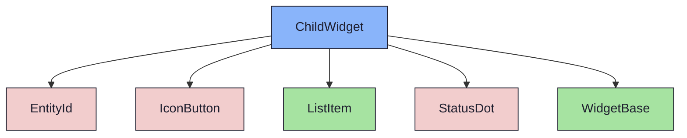
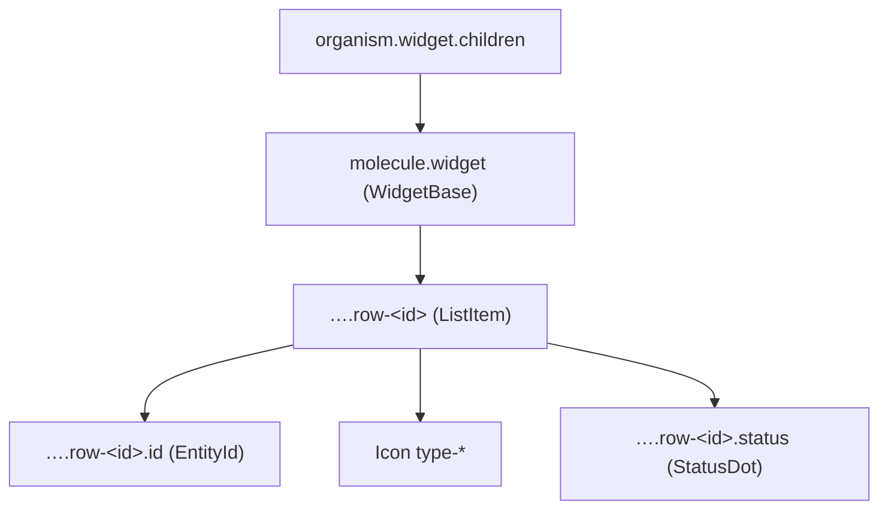

{/* ChildWidget — Narrativ-Wahrheit. Norm: docs/doc-mdx-Norm.md. */}
import { Meta, Canvas, ArgTypes } from '@storybook/addon-docs/blocks'
import * as Stories from './ChildWidget.stories.jsx'

<Meta of={Stories} />

# ChildWidget

`status:open` · Organism · Cluster `04 ORGANISMS/ChildWidget`

## Kurzbeschreibung

Liste der Kind-Issues (Issues eines Sprints, Sprints eines Milestones) — volle
Breite im Content-Grid.

## Zweck

Konkreter Content-Organism. Komponiert `WidgetBase` + `ListItem` (Molecule) +
`EntityId` + `StatusDot` (Atome) + `Icon` (Issue-Typ). Der Typ wird über eine
feste Map auf ein Registry-Icon abgebildet (`core → type-chore`, mangels eigenem
Glyph). Presentational, props-driven.

## Wann verwenden

- **Ja:** untergeordnete Entitäten als Zeilen-Liste mit Status.
- **Nein:** abhakbare Kriterien → `ChecklistWidget`. Freitext → `TextWidget`.

## Props

<ArgTypes of={Stories} />

## Zustände

Achse `collapsed`; jede Zeile trägt Typ-Icon (links) und Status (rechts):

<Canvas of={Stories.Default} />

## Abhängigkeiten (Komposition)

{/* AUTOGEN:composition START */}

{/* AUTOGEN:composition END */}

## data-ui-Anker

| Teil | data-ui | Zweck |
| --- | --- | --- |
| Wurzel | `organism.widget.children` | Widget |
| Zeile | `…​.row-<id>` | ListItem je Issue |
| ID | `…​.row-<id>.id` | EntityId |
| Status | `…​.row-<id>.status` | StatusDot |

