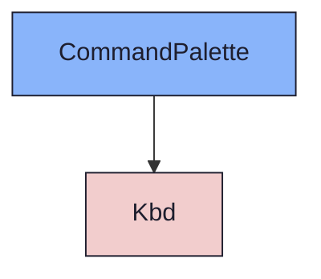
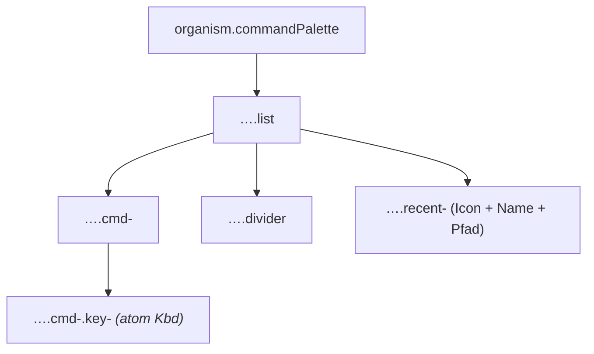

{/* CommandPalette — Narrativ-Wahrheit. Norm: docs/doc-mdx-Norm.md. */}
import { Meta, Canvas, ArgTypes } from '@storybook/addon-docs/blocks'
import * as Stories from './CommandPalette.stories.jsx'

<Meta of={Stories} />

# CommandPalette

`status:open` · Organism · Cluster `04 ORGANISMS/CommandPalette`

## Kurzbeschreibung

Codium-Stil-Befehlsliste (Popover unter der Suche): oben Befehle mit Mnemonic
und Shortcut-Chips, darunter — durch einen Divider getrennt — die zuletzt
geöffneten Einträge.

## Zweck

Konkreter, presentational Organism. Komponiert `Kbd` (Shortcut-Tasten) und
`Icon` (Recent-Glyphen). Reine Karte ohne eigenen Scrim — der Consumer
positioniert sie an ihrem Anker. Dumb — `commands`/`recent` als Props.

## Wann verwenden

- **Ja:** Sprung-/Befehls-Suche (⌘K) als Popover unter der Command-Bar.
- **Nein:** statisches Filter-Popover → `FilterMenu`. Modale Erfassung → `FormDialog`.

## Props

<ArgTypes of={Stories} />

## Zustände

Achsen `commands` (Label · Mnemonic · Shortcut-Chips, erste Zeile aktiv
hervorgehoben) und `recent` (Glyph · Name · Pfad · optional „zuletzt geöffnet").

<Canvas of={Stories.Default} />

## Barrierefreiheit

### ARIA

Wurzel trägt `role="listbox"` + `aria-label`. Jede Zeile ist `role="option"`;
die aktive Befehlszeile trägt `aria-selected`.

### Keyboard

Im Mockup statisch. Im verdrahteten Zustand: ↑/↓ navigiert die Optionen, Enter
aktiviert, Esc schließt (Consumer-Logik).

## Abhängigkeiten (Komposition)

{/* AUTOGEN:composition START */}

{/* AUTOGEN:composition END */}

## data-ui-Anker

| Teil | data-ui | Zweck |
| --- | --- | --- |
| Wurzel | `organism.commandPalette.<scope>` | Karte (role=listbox) |
| Liste | `…​.list` | Zeilen-Container |
| Befehl | `…​.cmd-<label>` | Befehlszeile (role=option) |
| Shortcut | `…​.cmd-<label>.key-<i>` | Kbd-Taste |
| Divider | `…​.divider` | Trennlinie |
| Recent | `…​.recent-<name>` | zuletzt geöffnet (role=option) |

