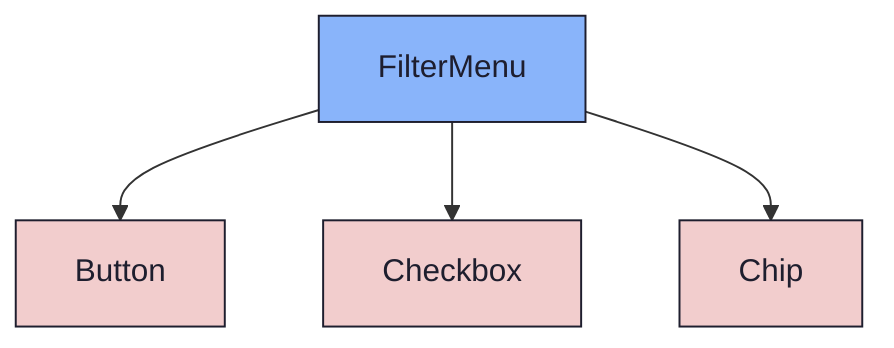
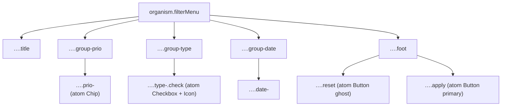

{/* FilterMenu — Narrativ-Wahrheit. Norm: docs/doc-mdx-Norm.md. */}
import { Meta, Canvas, ArgTypes } from '@storybook/addon-docs/blocks'
import * as Stories from './FilterMenu.stories.jsx'

<Meta of={Stories} />

# FilterMenu

`status:open` · Organism · Cluster `04 ORGANISMS/FilterMenu`

## Kurzbeschreibung

Anker-loses Popover-Panel zum Filtern einer Liste: Prioritäts-Chips,
Issue-Typ-Checkboxen und ein Zeitraum-Block, abgeschlossen mit
Zurücksetzen / Anwenden.

## Zweck

Konkreter, presentational Organism ohne eigenen Scrim — der Consumer
positioniert ihn an seinem Anker (z.B. Filter-Button). Komponiert `Chip`
(Prioritäten), `Checkbox` + `Icon` (Issue-Typen) und `Button` (Fuß). Dumb —
Auswahl-State und Callbacks `onApply`/`onReset` liegen beim Consumer.

## Wann verwenden

- **Ja:** Optionen-Popover an einem Anker (Filter-/Sort-Button) ohne Scrim.
- **Nein:** modale Eingabe mit Scrim → `FormDialog`. Befehlsliste/Sprung-Suche → `CommandPalette`.

## Props

<ArgTypes of={Stories} />

## Zustände

Achsen `prios` (Chip-Reihe) und `types` (Checkbox-Zeilen mit Typ-Icon). Der
Zeitraum-Block ist statisch (von/bis).

<Canvas of={Stories.Default} />

## Barrierefreiheit

### ARIA

Wurzel trägt `role="group"` + `aria-label="Filtern nach"`. Die Typ-Checkboxen
sind `Checkbox`-Atome (`role="checkbox"` + `aria-checked`).

### Keyboard

Chips, Checkboxen und Buttons sind native, fokussierbare Atome → Tab folgt dem
DOM; Enter/Space aktiviert.

## Abhängigkeiten (Komposition)

{/* AUTOGEN:composition START */}

{/* AUTOGEN:composition END */}

## data-ui-Anker

| Teil | data-ui | Zweck |
| --- | --- | --- |
| Wurzel | `organism.filterMenu.<scope>` | Popover-Karte (role=group) |
| Titel | `…​.title` | „Filtern nach" |
| Prio-Gruppe | `…​.group-prio` | Chip-Reihe |
| Prio-Chip | `…​.prio-
` | einzelne Priorität |
| Typ-Gruppe | `…​.group-type` | Issue-Typen |
| Typ-Check | `…​.type-<key>.check` | Checkbox je Typ |
| Datums-Gruppe | `…​.group-date` | Zeitraum |
| Datums-Feld | `…​.date-<von|bis>` | von/bis |
| Fuß | `…​.foot` | Aktions-Zeile |
| Zurücksetzen | `…​.reset` | Ghost-Button |
| Anwenden | `…​.apply` | Primary-Button |

