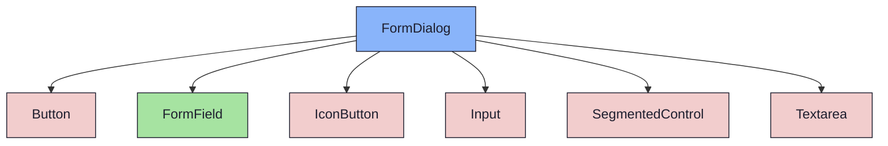
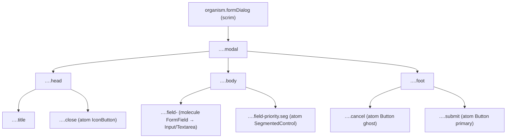

{/* FormDialog — Narrativ-Wahrheit. Norm: docs/doc-mdx-Norm.md. */}
import { Meta, Canvas, ArgTypes } from '@storybook/addon-docs/blocks'
import * as Stories from './FormDialog.stories.jsx'

<Meta of={Stories} />

# FormDialog

`status:open` · Organism · Cluster `04 ORGANISMS/FormDialog`

## Kurzbeschreibung

Modaler Eingabe-Dialog über einem Dim-Scrim — Kopf (Titel + Schließen), Body
(betitelte Felder + Prioritäts-Umschalter), Fuß (Abbrechen / Speichern).

## Zweck

Konkreter, presentational Organism. Komponiert `IconButton` (Schließen),
`FormField` (Molecule) um `Input`/`Textarea`, `SegmentedControl` (Priorität)
und `Button` (Fuß-Aktionen). Keine rohen Controls. Dumb — Daten als Props,
Callbacks `onClose`/`onSubmit` reicht der Consumer.

## Wann verwenden

- **Ja:** fokussierte Erfassung weniger Felder über dem aktuellen Screen (z.B. neues Akzeptanzkriterium).
- **Nein:** anker-loses Optionen-Popover ohne Scrim → `FilterMenu`. Voller Bearbeitungs-Screen → eigener Screen.

## Props

<ArgTypes of={Stories} />

## Zustände

Achsen `title`, `fields` (Input/Textarea), `priority` (aktiver Prio-Key),
`primaryLabel`. Der Scrim (Dim via `color-mix`) füllt den nächsten
`relative`-Vorfahren.

<Canvas of={Stories.Default} />

## Barrierefreiheit

### ARIA

Modal trägt `role="dialog"` + `aria-modal="true"` + `aria-label` (Titel).
Schließen-Button hat `aria-label="Schließen"` (Icon-only).

### Keyboard

Felder/Buttons sind native, fokussierbare Atome → Tab-Reihenfolge folgt dem
DOM (Felder → Priorität → Abbrechen → Speichern). Enter/Space lösen Buttons aus.

## Abhängigkeiten (Komposition)

{/* AUTOGEN:composition START */}

{/* AUTOGEN:composition END */}

## data-ui-Anker

| Teil | data-ui | Zweck |
| --- | --- | --- |
| Wurzel/Scrim | `organism.formDialog.<scope>` | Dim-Layer |
| Modal | `…​.modal` | Dialog-Box (role=dialog) |
| Kopf | `…​.head` | Titel-Zeile |
| Titel | `…​.title` | Überschrift |
| Schließen | `…​.close` | IconButton |
| Body | `…​.body` | Feld-Stack |
| Feld | `…​.field-<label>` | FormField je Feld |
| Priorität | `…​.field-priority.seg` | SegmentedControl |
| Fuß | `…​.foot` | Aktions-Zeile |
| Abbrechen | `…​.cancel` | Ghost-Button |
| Speichern | `…​.submit` | Primary-Button |

