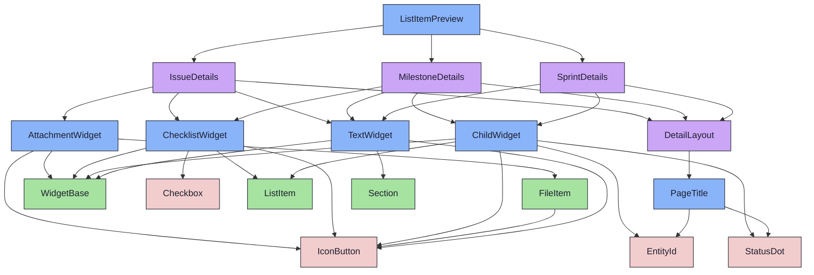
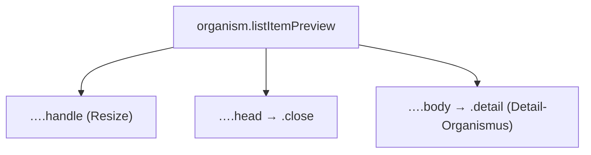

{/* ListItemPreview — Narrativ-Wahrheit. Norm: docs/doc-mdx-Norm.md. */}
import { Meta, Canvas, ArgTypes } from '@storybook/addon-docs/blocks'
import * as Stories from './ListItemPreview.stories.jsx'

<Meta of={Stories} />

# ListItemPreview

`status:review` · Organism · Cluster `04 ORGANISMS/ListItemPreview`

## Kurzbeschreibung

Push-Panel rechts der Liste (Spec §5). Zeigt den passenden Detail-Organismus zum
aktiven Element und reicht ihn direkt durch: Issue → `IssueDetails`, Sprint →
`SprintDetails`, Milestone → `MilestoneDetails`. Drag-Handle (4px) signalisiert Resize.

## Zweck

Bietet die Detailsicht ohne Modal/Routing-Wechsel. Importiert die bestehenden
Detail-Screens (kein Re-Build, kein Drift). Resize ist im Echtbau frei
(min 280px / max 60vw, localStorage); im Mockup sind die Breiten diskrete
`size`-Stufen, damit die Zustände ohne Interaktivität sichtbar sind.

## Wann verwenden

- **Ja:** Inline-Detailansicht neben der Browser-Liste.
- **Nein:** Vollbild-Detailseite → direkt der Detail-Screen ohne Panel-Hülle.

## Props

<ArgTypes of={Stories} />

## Zustände

Achsen Elementtyp + Breitenstufe:

<Canvas of={Stories.Issue} />
<Canvas of={Stories.Sprint} />
<Canvas of={Stories.Milestone} />
<Canvas of={Stories.Compact} />

## Barrierefreiheit

### ARIA
Panel ist ein `<aside>`; der Schließen-Button trägt `aria-label="Schließen"`. Der
Drag-Handle ist `aria-hidden` (rein visuelle Affordanz).

### Keyboard
Schließen-Button ist erster Tab-Stop; danach folgt der Detail-Organismus. `Escape`-
Schließen + ↑/↓-Navigation (Spec §5/§8) sind Wrapper-Verhalten, nicht presentational.

> **Hinweis (D04):** Die echte `compact`-Stack-Prop auf `DetailLayout` (unter 360 px
> alle Sektionen gestapelt) ist ein Promote-Task (T02). Hier nur visuelle Näherung —
> `src/ui` bleibt unberührt.

## Abhängigkeiten (Komposition)

{/* AUTOGEN:composition START */}

{/* AUTOGEN:composition END */}

## data-ui-Anker

