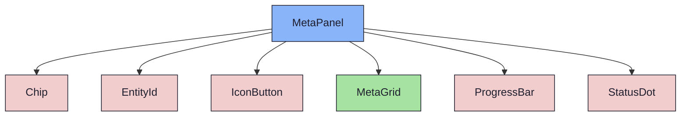

{/* MetaPanel — Narrativ-Wahrheit. Norm: docs/doc-mdx-Norm.md. */}
import { Meta, Canvas, ArgTypes } from '@storybook/addon-docs/blocks'
import * as Stories from './MetaPanel.stories.jsx'

<Meta of={Stories} />

# MetaPanel

`status:open` · Organism · Cluster `04 ORGANISMS/MetaPanel`

## Kurzbeschreibung

Rechte Metadaten-/Aktions-Spalte mit zwei Modi: **rows-Modus** (generische
`MetaGrid` aus `rows`) und **entity-Modus** (board-kontextuell: die ausgewählte
Sprint-Card oder Meilenstein-Spalte mit kind-spezifischen Details und einem
Transition-Widget zum direkten Status-Wechsel). Ein-/ausklappbar (→ schmale Rail).

## Zweck

Konkreter Organism für die rechte Detail-Spalte. Modus-Wahl über `entity`: gesetzt →
entity-Modus (typisierter Kopf via `EntityId` + `StatusDot`, Details via `MetaGrid`,
Fortschritt via `ProgressBar`, Status-Optionen via `Chip`), sonst rows-Modus.
Das Transition-Widget zeigt den aktuellen Status + erlaubte Folge-Status (presentational
`NEXT_STATUS`, Spiegel von `lifecycle.js`) — Klick reicht `onTransition(next)` hoch.
Presentational: echte Validierung/Mutation = Phase 3 (PO).

## Wann verwenden

- **Ja:** rechte Detail-/Metadaten-Spalte neben dem Content; im Board als kontextuelles
  Panel der Auswahl (Sprint/Meilenstein) inkl. Schnell-Statuswechsel.
- **Nein:** Metadaten-Grid solo im Content → `MetaGrid`. Einzel-Toggle → `IconButton`.

## Props

<ArgTypes of={Stories} />

## Zustände

- **rows-Modus:** `Open` (Kopf + MetaGrid) ↔ `Collapsed` (Rail). `Placeholder`
  (leere rows) = „always"-Panel ohne Auswahl.
- **entity-Modus:** `EntitySprint` (Fortschritt + Transition active→…), `EntityMilestone`,
  `EntityTerminal` (Endzustand, keine Folge-Status), `EntityCollapsed` (Rail).

<Canvas of={Stories.EntitySprint} />
<Canvas of={Stories.EntityMilestone} />
<Canvas of={Stories.EntityTerminal} />
<Canvas of={Stories.Placeholder} />
<Canvas of={Stories.Open} />
<Canvas of={Stories.Collapsed} />

## Barrierefreiheit

### ARIA

Klapp-Toggle und Transition-Chips sind echte `<button>` (`IconButton`/`Chip`) mit
`aria-label`/`aria-pressed`. Der aktuelle Status ist als aktiver Chip markiert.

### Keyboard

Toggle, ↗-Detail-Button und Transition-Chips sind per Tab fokus- und per Enter/Space
aktivierbar. MetaGrid/ProgressBar sind reine Anzeige.

## Abhängigkeiten (Komposition)

{/* AUTOGEN:composition START */}

{/* AUTOGEN:composition END */}

## data-ui-Anker

| Teil | data-ui | Zweck |
| --- | --- | --- |
| Wurzel | `organism.metaPanel` | Panel/Rail |
| Kopf | `…​.head` | Titel/EntityId + Toggle |
| Toggle | `…​.toggle` | Ein-/Ausklapp-Button |
| ↗ Detail | `…​.open` | Detail-Page öffnen (entity-Modus) |
| Kind-Label | `…​.kind` | „Sprint"/„Meilenstein" |
| Meta | `…​.meta` | MetaGrid (entity-Modus) |
| Fortschritt | `…​.progress` | ProgressBar (Sprint) |
| Transition | `…​.transition` | Status-Widget |
| · aktuell | `…​.transition.current` | aktiver Status-Chip |
| · Option | `…​.transition.to-<status>` | Folge-Status-Chip |
| Body | `…​.body` | Inhalt (rows-Modus) |
| Grid | `…​.grid` | MetaGrid (rows-Modus) |
| Platzhalter | `…​.empty` | „Wähle eine Spalte oder Karte" |
| Rail-Label | `…​.label` | vertikales Label (kollabiert) |
