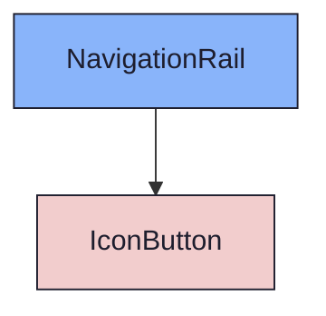
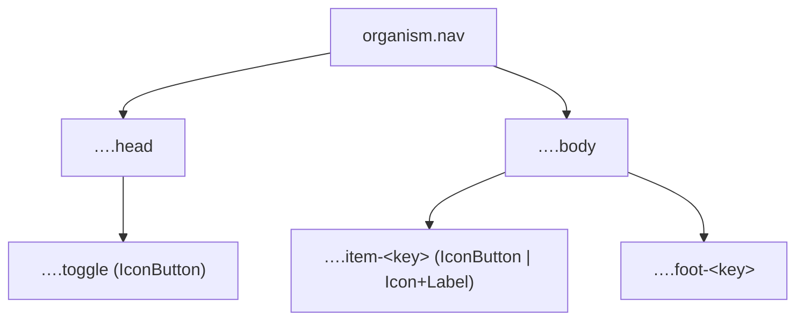

{/* NavigationRail — Narrativ-Wahrheit. Norm: docs/doc-mdx-Norm.md. */}
import { Meta, Canvas, ArgTypes } from '@storybook/addon-docs/blocks'
import * as Stories from './NavigationRail.stories.jsx'

<Meta of={Stories} />

# NavigationRail

`status:open` · Organism · Cluster `04 ORGANISMS/NavigationRail`

## Kurzbeschreibung

Vertikale Haupt-Navigation der Shell. Zwei Zustände über `wide`: schmal/icon-only
(Default) ↔ breit/mit-Labels. Kopf trägt den Klapp-Toggle, Fuß-Items sitzen
unten (über einen Spacer abgesetzt).

## Zweck

Konkreter Shell-Organism. Schmal komponiert je Item ein `IconButton` (`on` =
aktiv); breit rendert Label-Zeilen aus `Icon` + Text mit Akzent-Tick links für
den aktiven Eintrag. Item-`key` ist zugleich der Registry-Icon-Key.
Presentational, props-driven.

## Wann verwenden

- **Ja:** primäre App-Navigation links neben dem ProjectBrowser.
- **Nein:** Struktur-Baum eines Projekts → `ProjectBrowser`. Einzel-Toggle → `IconButton`.

## Props

<ArgTypes of={Stories} />

## Zustände

Achse `wide`: schmal (icon-only) ↔ breit (mit Labels). Aktiver Eintrag trägt
Akzentfarbe; im breiten Zustand zusätzlich einen Tick links.

<Canvas of={Stories.Collapsed} />
<Canvas of={Stories.Wide} />

## Barrierefreiheit

### ARIA

Jedes Item ist ein echtes `<button>`; im schmalen Zustand trägt `IconButton`
`aria-label` (Icon-only ist bedeutungstragend) und `aria-pressed` für den
aktiven Eintrag.

### Keyboard

Alle Items sind per Tab fokus- und per Enter/Space aktivierbar — inklusive des
Kopf-Toggles, der zwischen schmal und breit umschaltet.

## Abhängigkeiten (Komposition)

{/* AUTOGEN:composition START */}

{/* AUTOGEN:composition END */}

## data-ui-Anker

| Teil | data-ui | Zweck |
| --- | --- | --- |
| Wurzel | `organism.nav` | Rail |
| Kopf | `…​.head` | Kopf-Band |
| Toggle | `…​.toggle` | Klapp-Button |
| Body | `…​.body` | Item-Spalte |
| Item | `…​.item-<key>` | Nav-Eintrag |
| Fuß-Item | `…​.foot-<key>` | Fuß-Eintrag |

