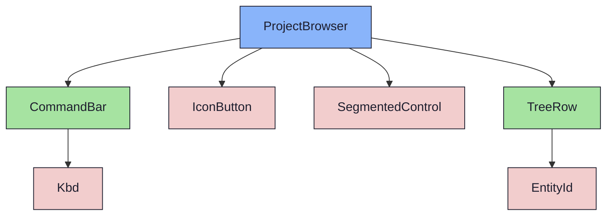
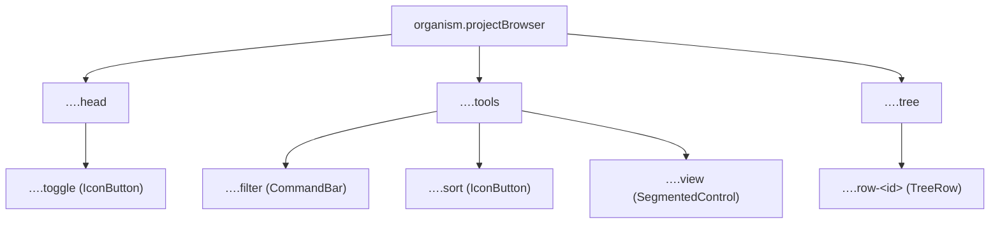

{/* ProjectBrowser — Narrativ-Wahrheit. Norm: docs/doc-mdx-Norm.md. */}
import { Meta, Canvas, ArgTypes } from '@storybook/addon-docs/blocks'
import * as Stories from './ProjectBrowser.stories.jsx'

<Meta of={Stories} />

# ProjectBrowser

`status:open` · Organism · Cluster `04 ORGANISMS/ProjectBrowser`

## Kurzbeschreibung

Linke Shell-Spalte (VS-Code-artig): zeigt die Projekt-Struktur Milestone › Sprint
› Issue als Baum, mit Such-/Sort-/Filter-Tools und Umschalt Struktur↔Backlog.
Ein-/ausklappbar.

## Zweck

Konkreter Shell-Organism. Komponiert `CommandBar` (Filter-Feld), `IconButton`
(Sort/Filter/Toggle), `SegmentedControl` (View-Umschalt) und je Baum-Zeile ein
`TreeRow` (farbcodierte ID + Caret + Lead/Label). Kollabiert auf einen schmalen
Streifen mit vertikalem Label. Presentational, props-driven.

## Wann verwenden

- **Ja:** linke Struktur-/Navigations-Spalte eines Projekts.
- **Nein:** App-weite Haupt-Navigation → `NavigationRail`. Einzelne Zeile → `TreeRow`.

## Props

<ArgTypes of={Stories} />

## Zustände

Achse `collapsed`: offen (Kopf + Tools + Baum, 264px) ↔ Streifen (40px, vertikales
Label). Der aktive Baum-Knoten ist hervorgehoben.

<Canvas of={Stories.Open} />
<Canvas of={Stories.Collapsed} />

## Barrierefreiheit

### ARIA

Toggle, Sort und Filter sind echte `<button>` (`IconButton`) mit `aria-label`.
Der View-Umschalter (`SegmentedControl`) trägt `role="tablist"` mit `role="tab"`
+ `aria-selected` je Segment.

### Keyboard

Alle Bedien-Elemente (Toggle, Sort, Filter, View-Segmente) sind per Tab fokus-
und per Enter/Space aktivierbar. Die Baum-Zeilen sind hier Anzeige (Klick-Logik
im Consumer).

## Abhängigkeiten (Komposition)

{/* AUTOGEN:composition START */}

{/* AUTOGEN:composition END */}

## data-ui-Anker

| Teil | data-ui | Zweck |
| --- | --- | --- |
| Wurzel | `organism.projectBrowser` | Panel/Streifen |
| Kopf | `…​.head` | Titel + Toggle |
| Toggle | `…​.toggle` | Ein-/Ausklapp-Button |
| Tools | `…​.tools` | Filter + Sort/Filter + View |
| Filter | `…​.filter` | CommandBar |
| View | `…​.view` | SegmentedControl |
| Baum | `…​.tree` | Scroll-Bereich |
| Zeile | `…​.row-<id>` | TreeRow |
| Label | `…​.label` | vertikales Label (kollabiert) |

