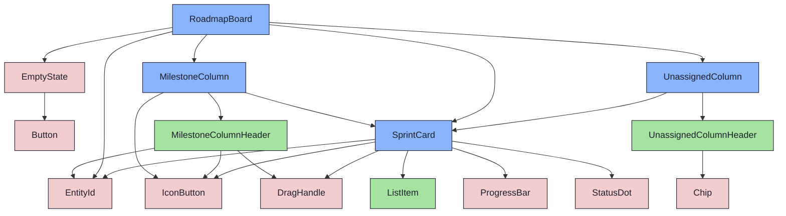

import { Meta, Canvas, ArgTypes } from '@storybook/addon-docs/blocks'
import * as Stories from './RoadmapBoard.stories.jsx'

<Meta of={Stories} />

# RoadmapBoard

`status:open` · Organism (complex) · Cluster `RoadmapBoard`

## Kurzbeschreibung

Spalten-Board der Roadmap: jeder Meilenstein ist eine Spalte, jeder Sprint eine
Card. Sprints lassen sich per Drag & Drop zuordnen, Meilensteine
abhängigkeitsbewusst umsortieren.

## Zweck

Eckpfeiler-Organismus (D07). Kapselt den einzigen `DndContext` (echtes
`@dnd-kit`), die Wrapper für Draggable/Droppable und die Optimistic Updates (D02).
Die reine DnD-Mathe (ID-Schema, Reorder, Dep-Validierung, Card-Move) liegt
token-frei und unit-getestet in `lib/roadmapBoardDnd.js`, die Sensoren in
`lib/dndSensors.js`. Komponiert `MilestoneColumn` (× n, nach `position`) +
`UnassignedColumn` (rechts, D05) + `DragOverlay` (Ghost) + `EmptyState`.

**Layout (Iteration 4):** 2-Spalten-Makro. Rechts die **gepinnte**
`UnassignedColumn`, die nicht mit scrollt — gerendert nur, solange
Unassigned-Sprints existieren oder ein Drag aktiv ist (Un-Assign-Drop-Ziel);
sonst ausgeblendet. Links die **scrollbare** Meilenstein-Reihe, deren Breite an
die rechte Spalte gekoppelt ist: **mit** Unassigned feste 3-Column-Breite
(deckungsgleich mit der `BrowserToolbar`), **ohne** Unassigned füllt der Strip die
volle Breite (`flex-1`).

**Mockup-Phase (Promote 1+2):** presentational — Daten kommen als Props
(Story-Fixtures). Kein Live-Fetch hier; der Connected-Wrapper + Route folgen in
Phase 3 (PO). MSW-Handler (`foundations/fixtures/roadmap.handlers.js`) liegen
dafür bereit.

## Wann verwenden

- **Ja:** als Haupt-Inhalt des `RoadmapBoardScreen` (Roadmap-Übersicht + Planung).
- **Nein:** flache Issue-/Sprint-Liste → `ElementBrowser`. Einzelnes Sprint-Detail
  → `SprintDetails`.

## Props

<ArgTypes of={Stories} />

## Zustände

`Default` (3 Meilensteine + Staging, Live-Drag testbar), `Empty` (kein Meilenstein
→ EmptyState), `Loading` (Skeleton-Spalten), `DragActive` (statisch: Spalte M1
gezogen, Drop-Ziel M3 → Indikator-Linie + isOver-Highlight, Quelle gedimmt),
`Wide` (breite Spalten + Meilenstein-/Sprint-Details, M2 mit Dep-Badge),
`NoUnassigned` (keine Staging-Sprints → gepinnte Unassigned-Spalte ausgeblendet),
`SnapPlayground` (6 Meilensteine + `snap`-Control zum Vergleich der
Scroll-Snap-Modi).

<Canvas of={Stories.Default} />
<Canvas of={Stories.DragActive} />
<Canvas of={Stories.Wide} />
<Canvas of={Stories.NoUnassigned} />
<Canvas of={Stories.SnapPlayground} />
<Canvas of={Stories.Empty} />

## Barrierefreiheit

### ARIA

Spalten-Reihe `role="region" aria-label="Roadmap"`; jede Spalte `role="group"`.
Drop-Indikator `aria-hidden`. Blockierter Reorder wird über eine
`role="status" aria-live="polite"`-Region angesagt.

### Keyboard

Pro DragHandle: `Space`/`Enter` startet den Keyboard-Drag (KeyboardSensor),
Pfeiltasten bewegen, `Space`/`Enter` bestätigt, `Escape` bricht ab. Card-Body
bleibt separat per Tab fokussier- und mit Enter öffenbar.

## Aktueller Stand

### Board-Container
- Rolle: Daten (Props) → Spalten/Cards, DnD-Orchestrierung, Optimistic Updates.
- Wiring-Stand: **Mockup** — presentational verdrahtet; Connected-Wrapper offen (Phase 3).

### Decision-Log

| # | Entscheidung | Stand |
|---|---|---|
| D01 | DnD-Bibliothek `@dnd-kit` (core + sortable) | 🟢 umgesetzt |
| D02 | Optimistic Updates im lokalen State | 🟢 umgesetzt |
| D03 | `.milestone-tile*`-CSS als Base — **Abweichung:** Header nutzt eigene Token-Klassen (die `__name`-Link-Unterstreichung passt nicht zum Spalten-Titel) | 🟡 dokumentiert |
| D04 | SprintCard mit Varianten `active`/`completed` (eine Quelle) | 🟢 umgesetzt |
| D05 | UnassignedColumn rechts | 🟢 umgesetzt |
| D06 | Dependency-Validierung client-seitig (`validateColumnReorder`) | 🟢 umgesetzt |
| D07 | RoadmapBoard = `organisms/complex` | 🟢 umgesetzt |
| D08 | Gap-Analyse nach Mockup | 🟢 siehe unten |
| PO-1 | DnD echt (statt presentational-Fake) | 🟢 umgesetzt |
| PO-2 | Completed initial collapsed + Toggle (Q04) | 🟢 umgesetzt |
| PO-3 | Unassigned: layer-3 + dashed (Q03) | 🟢 umgesetzt |
| PO-4 | ProgressBar: done+passed grün, cancelled raus (Q01) | 🟢 umgesetzt |

### Decision-Log — Iteration 2 (6 PO-Erweiterungen)

| # | Entscheidung | Stand |
|---|---|---|
| I2-1 | Screen-Kopf nutzt `PageTitle` (Konsistenz) statt leichter Titelzeile — `PageTitle` minimal um `icon` erweitert, Status/`kind` optional. Roadmap: Icon + Slug + Stats-Meta, **kein** Status | 🟢 umgesetzt |
| I2-2 | `MilestoneColumn` auf WidgetBase-Tokens (`mantle`/`--border` + Header-Divider) statt `layer-2/surface0`. **Nicht** in `WidgetBase` gewrappt (dessen Accordion/Hue-Header + fehlender Drop-Body passen nicht) — nur die Tokens | 🟢 umgesetzt |
| I2-3 | Wide-Mode-Toggle (`expand`-Icon, neu in Registry): verdoppelt Spaltenbreite, blendet Meilenstein-Details (Ziel mehrzeilig + Zieldatum + DoD + Dep-Badge) + Sprint-Details + Issue-Chevron ein. State lebt im Screen | 🟢 umgesetzt |
| I2-4 | Verlinkung: „öffnen"-`IconButton` (`external`) rechts im Header → `onOpenMilestone`; Sprint-Titel → `onOpenSprint`. Mockup-Spies; Route-Wiring Phase 3 | 🟢 umgesetzt |
| I2-5 | Suche: `BrowserToolbar` im Screen; reine `lib/roadmapBoardFilter`-Fn (TDD). Regel: Spalte bei Eigen- ODER Sprint-Treffer; bei Eigen-Treffer alle Sprints, sonst nur Treffer | 🟢 umgesetzt |
| I2-6 | `CreateActions` (neue Molecule, 3 Buttons je Entität, kein Split/Dropdown) in der Steuerzeile | 🟢 umgesetzt |

### Decision-Log — Iteration 4 (2-Spalten-Board)

| # | Entscheidung | Stand |
|---|---|---|
| I4-1 | Board = 2-Spalten-Makro: links scrollbare Meilenstein-Reihe, rechts gepinnte `UnassignedColumn` (scrollt nicht mit). Strip-Breite an die rechte Spalte gekoppelt: mit Unassigned feste 3-Column-Breite (deckungsgleich mit `BrowserToolbar`), ohne sie `flex-1` (volle Breite) | 🟢 umgesetzt |
| I4-2 | Unassigned-Spalte nur sichtbar bei vorhandenen Staging-Sprints **oder** aktivem Drag (erhält Un-Assign-Drop-Ziel); sonst ausgeblendet → Meilenstein-Strip füllt den Bereich | 🟢 umgesetzt |
| I4-3 | Screen-Steuerzeile: Actions-Panel `ml-auto` entfernt, Row-Gap `space-4` → linke Kante deckungsgleich mit der Unassigned-Spalte darunter | 🟢 umgesetzt |
| I4-4 | Scroll-Snap als `snap`-Prop (`mandatory`/`proximity`/`none`, Default `mandatory` — PO: passt am besten zur Tastatur) — Story `SnapPlayground` mit Control zum Vergleich | 🟢 umgesetzt |
| I5-6 | Scrollbar der Meilenstein-Reihe ausgeblendet (`.no-scrollbar`-Utility in index.css, unlayered → schlägt globale `*`-Scrollbar) — Höhe der Reihe = Spaltenhöhe, kein Mismatch zum MetaPanel | 🟢 umgesetzt |

### Offene ToDos / Fragen

| # | Punkt | Stand |
|---|---|---|
| T-shake | Q02-Feedback bei blockiertem Reorder: aktuell `aria-live`-Ansage + Danger-Ring-Puls. Echtes „Shake" braucht ein Keyframe-Token in `index.css` (bewusst nicht im Mockup angelegt). | 🟣 offen |
| T-route | Q05/I2-4: Klick auf SprintCard/„öffnen" → Route `/:slug/sprints/:id` bzw. `/:slug/milestones/:id`. Callbacks (`onOpenSprint`/`onOpenMilestone`) verdrahtet; Route-Wiring (`useProjectNav`) in Phase 3. | 🟣 offen |
| T-depbadge | Q07/I2-3: Dep-Kette auf dem Header — als Wide-Badge („nach M{n}") umgesetzt. Schmaler Modus zeigt es (noch) nicht. | 🟢 teilweise |
| T-filtermenu | I2-5: `BrowserToolbar`-FilterMenu-Popover ist im Mockup leer; Status-/Typ-Filter (Slot `filterMenu`) optional ergänzen. | 🟣 offen |
| T-connect | Phase 3: Connected-Wrapper (`src/lib` + Hooks), Routen in `_shell/routes`, Create-Aktionen, Augenschein gegen Live-Backend. | 🟣 offen |

### Backend-Gap-Analyse (D08)

| # | Lücke | Befund | Konsequenz |
|---|---|---|---|
| G1 | Milestone hat kein `goal` | `GET /api/milestones` liefert `description`, kein `goal` | Board mappt `goal ?? description` → Header-Ziel. Kein Backend-Change nötig. |
| G2 | Count-Semantik divergiert | `/api/milestones` (genested) = `issue_done` (done+passed) / `issue_total` (ohne cancelled); flaches `/api/sprints` = `done_count`/`item_count` (andere Buckets) | **Primärquelle = `/api/milestones`** (konsistent). Unassigned-Sprints aus `/api/sprints?milestone_id=none` müssen im Phase-3-Wrapper auf `issue_done`/`issue_total` gemappt werden. |
| G3 | Deps-Endpoint-Shape unbestätigt | `GET /api/milestones/:id/dependencies` existiert; Felder nicht final geprüft. Im Milestone-Detail liegen `dependencies_in/out` mit `dependency_id`. | Fixture nimmt `{ id, predecessor_id, successor_id }` an (Spec). Vor Phase-3-Verdrahtung gegen echte Response verifizieren. |
| G4 | Issue-Liste je Sprint (Wide-Mode) | `GET /api/milestones` liefert je Sprint **keine** Issues. Fixtures tragen `sprint.issues[]` (`{ key, title, status }`) nur fürs Mockup. | Phase 3: pro aufgeklapptem Sprint `GET /api/issues?sprint_id=` (lazy) — kein Eager-Load aller Issues. `dod_total` (Header) analog aus Milestone-DoD ableiten. |
| G5 | Wide-Felder nicht in `/api/milestones` | `target_date` vorhanden; `dod_total` ist abgeleitet (Anzahl DoD-Items), kein direktes Feld. | Phase-3-Wrapper berechnet `dod_total` aus `dependencies`/DoD-Endpoint; Fixture setzt es direkt. |

## Abhängigkeiten (Komposition)

{/* AUTOGEN:composition START */}

{/* AUTOGEN:composition END */}
