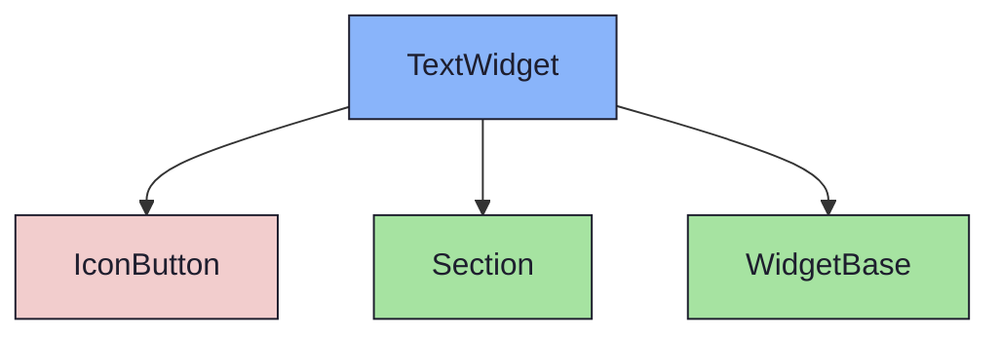
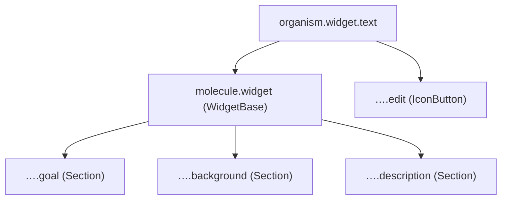

{/* TextWidget — Narrativ-Wahrheit. Norm: docs/doc-mdx-Norm.md. */}
import { Meta, Canvas, ArgTypes } from '@storybook/addon-docs/blocks'
import * as Stories from './TextWidget.stories.jsx'

<Meta of={Stories} />

# TextWidget

`status:open` · Organism · Cluster `04 ORGANISMS/TextWidget`

## Kurzbeschreibung

Beschreibungs-Widget mit benannten Abschnitten (Goal · Background · Description).

## Zweck

Konkreter Content-Organism. Komponiert `WidgetBase` (Accordion) + `Section` je
Abschnitt + `IconButton` (Bearbeiten). Presentational; `collapsed`/`onToggle`
werden an `WidgetBase` durchgereicht. Halbe Breite im Detail-Grid.

## Wann verwenden

- **Ja:** Freitext-Beschreibung/Refinement eines Issues/Sprints/Milestones.
- **Nein:** Datei-Liste → `AttachmentWidget`. Kind-Liste → `ChildWidget`.

## Props

<ArgTypes of={Stories} />

## Zustände

Achse `collapsed`:

<Canvas of={Stories.Default} />
<Canvas of={Stories.Collapsed} />

## Abhängigkeiten (Komposition)

{/* AUTOGEN:composition START */}

{/* AUTOGEN:composition END */}

## data-ui-Anker

