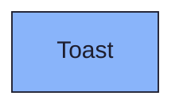
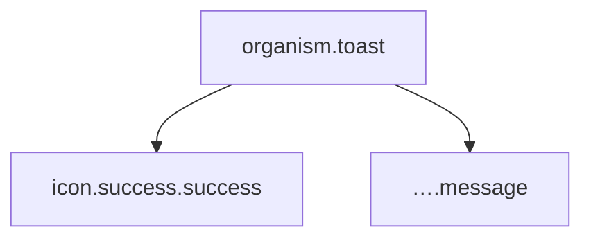

{/* Toast — Narrativ-Wahrheit. Norm: docs/doc-mdx-Norm.md. */}
import { Meta, Canvas, ArgTypes } from '@storybook/addon-docs/blocks'
import * as Stories from './Toast.stories.jsx'

<Meta of={Stories} />

# Toast

`status:open` · Organism · Cluster `04 ORGANISMS/Toast`

## Kurzbeschreibung

Flüchtiges Inline-Banner für Erfolgs-/Status-Meldungen (z.B. „Anhang
hinzugefügt") — grün-transparent hinterlegt, ohne Rundung.

## Zweck

Konkreter, presentational Organism. Komponiert das `Icon`-Atom (Registry,
Rolle `success`) mit einem kurzen Meldungstext. Dumb — keine Lebensdauer/Queue,
der Consumer steuert Sichtbarkeit.

## Wann verwenden

- **Ja:** kurze, selbstverschwindende Bestätigung einer gerade abgeschlossenen Aktion.
- **Nein:** dauerhafte Inline-Validierung am Feld → `FormField`. Blockierende Meldung → Dialog (`FormDialog`).

## Props

<ArgTypes of={Stories} />

## Zustände

Eine Achse `kind` (aktuell nur `success`). Text über `message`.

<Canvas of={Stories.Default} />

## Barrierefreiheit

### ARIA

Wurzel trägt `role="status"` → Screenreader lesen die Meldung als höfliche
Live-Region (nicht-unterbrechend) vor.

### Keyboard

Kein Fokus-Ziel — rein informativ, keine Interaktion.

## Abhängigkeiten (Komposition)

{/* AUTOGEN:composition START */}

{/* AUTOGEN:composition END */}

## data-ui-Anker

| Teil | data-ui | Zweck |
| --- | --- | --- |
| Wurzel | `organism.toast.<scope>` | Banner (role=status) |
| Text | `…​.message` | Meldungstext |
| Icon | `icon.success.success` | Erfolgs-Glyph |

