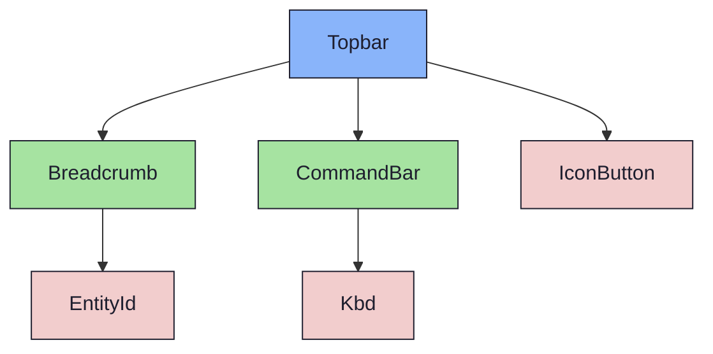
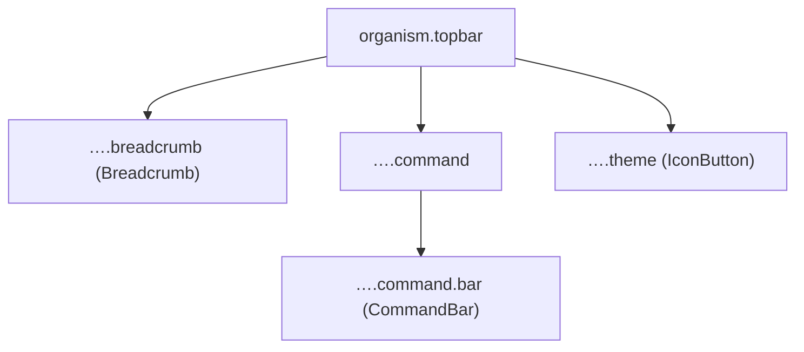

{/* Topbar — Narrativ-Wahrheit. Norm: docs/doc-mdx-Norm.md. */}
import { Meta, Canvas, ArgTypes } from '@storybook/addon-docs/blocks'
import * as Stories from './Topbar.stories.jsx'

<Meta of={Stories} />

# Topbar

`status:open` · Organism · Cluster `04 ORGANISMS/Topbar`

## Kurzbeschreibung

Obere Shell-Leiste (44px): Breadcrumb-Pfad links, zentrierte Command-Bar in der
Mitte, Theme-Toggle rechts. Liegt auf der mantle-Fläche mit unterer Trennlinie.

## Zweck

Konkreter Shell-Organism. Komponiert die Molecules `Breadcrumb` (Pfad) und
`CommandBar` (Such-/Befehls-Anzeige) sowie das Atom `IconButton` (Theme). Rein
präsentational, props-driven — Toast und Command-Palette gehören NICHT hierher
(Slice 6).

## Wann verwenden

- **Ja:** oberste Leiste der App-Shell über Rail/Browser/Content.
- **Nein:** reine Pfad-Anzeige → `Breadcrumb`. Such-Feld solo → `CommandBar`.

## Props

<ArgTypes of={Stories} />

## Zustände

Eine Achse — die statische Standardleiste mit Breadcrumb, Command-Bar und Theme-Toggle:

<Canvas of={Stories.Default} />

## Barrierefreiheit

### ARIA

Breadcrumb trägt `aria-label="Breadcrumb"`; der Theme-Toggle (`IconButton`)
rendert ein echtes `<button>` mit `aria-label` und `aria-pressed`.

### Keyboard

Theme-Toggle ist als `<button>` fokus- und aktivierbar (Tab/Enter/Space). Die
Command-Bar ist hier reine Anzeige (Such-Flow liegt im Consumer).

## Abhängigkeiten (Komposition)

{/* AUTOGEN:composition START */}

{/* AUTOGEN:composition END */}

## data-ui-Anker

| Teil | data-ui | Zweck |
| --- | --- | --- |
| Wurzel | `organism.topbar` | Leiste |
| Breadcrumb | `…​.breadcrumb` | Pfad (Molecule) |
| Command | `…​.command` | Mitte (zentriert) |
| Command-Bar | `…​.command.bar` | CommandBar (Molecule) |
| Theme | `…​.theme` | IconButton |

