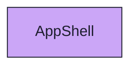

import { Meta, Canvas, ArgTypes } from '@storybook/addon-docs/blocks'
import * as Stories from './AppShell.stories.jsx'

<Meta of={Stories} />

# AppShell

`status:open` · Screen · Cluster `AppShell`

## Kurzbeschreibung

Die montierte App-Hülle: `NavigationRail` (links) + `Topbar` (oben, Breadcrumb) +
Content-Bereich (`<Outlet/>`) + `ToastHost`. Hier mit echten Screens im Content-Slot,
damit sich Screens **mit** Shell-Chrome bewerten lassen (Rail-Highlight, Breadcrumb,
Spacing/Tokens) — nicht nur als nackte Insel.

## Zweck

Der Frame selbst lebt in `src/screens/_shell/AppShellFrame.jsx` (handgebaute, dünne
Hülle aus den aktuellen Organismen — kein `src/ui`-Bauteil) und hat dort keine eigene
Story. Diese Story komponiert ihn für den Review-Augenschein: `MemoryRouter` aktiviert
die Router-Hooks (`useLocation`/`useProjectNav`), der **Pfad** je Story steuert das
aktive Rail-Item und den Breadcrumb. Presentational — Screens über Fixtures/Props,
Navigation als Spies.

## Wann verwenden

- **Ja:** Screen samt Shell-Chrome bewerten (sitzt das Rail-Highlight, stimmt der
  Breadcrumb, passt das Content-Padding).
- **Nein:** einen Screen isoliert prüfen → dessen eigene Story (`05 SCREENS/…`).

## Props

<ArgTypes of={Stories} />

## Zustände

`RoadmapImShell` (Roadmap-Board montiert, Rail auf „Roadmap"), `IssueDetailImShell`
(Detail-Screen, issues ohne Rail-Item → Rail-Default) und `LeereHuelle` (nur Chrome,
leerer Content).

<Canvas of={Stories.RoadmapImShell} />
<Canvas of={Stories.IssueDetailImShell} />
<Canvas of={Stories.LeereHuelle} />

## Abhängigkeiten (Komposition)

{/* AUTOGEN:composition START */}

{/* AUTOGEN:composition END */}
