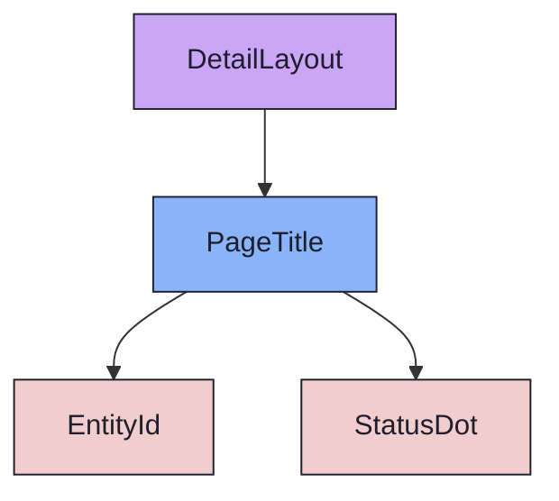
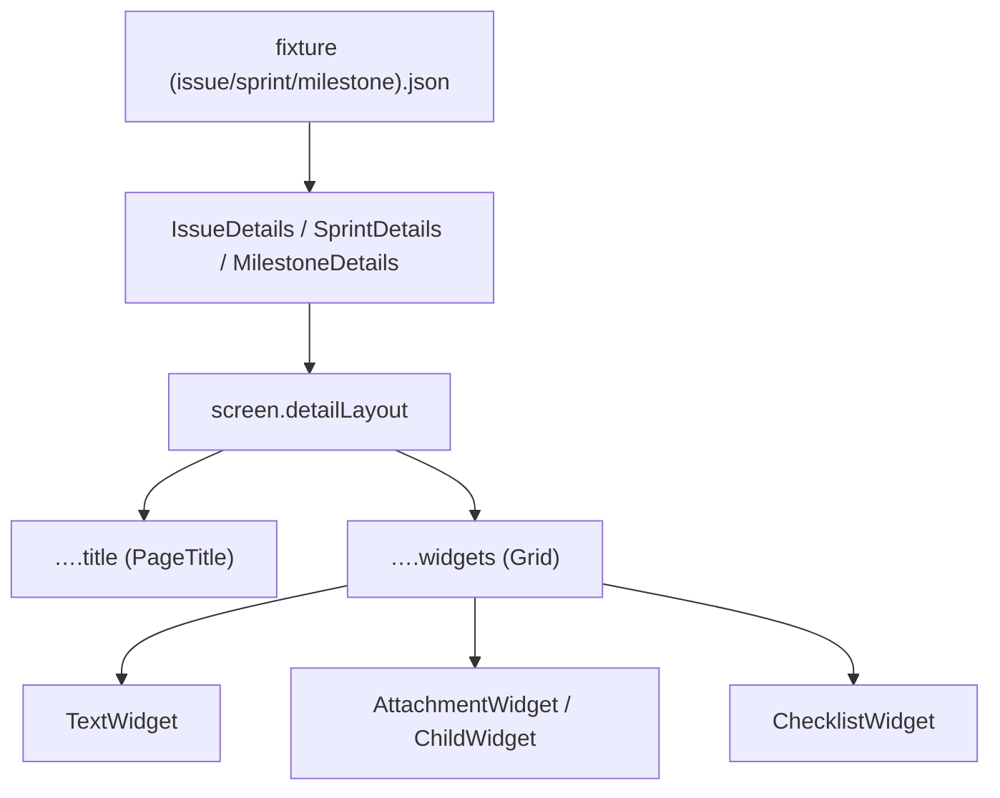

{/* DetailLayout — Narrativ-Wahrheit. Norm: docs/doc-mdx-Norm.md. */}
import { Meta, Canvas } from '@storybook/addon-docs/blocks'
import * as Stories from './DetailLayout.stories.jsx'

<Meta of={Stories} />

# DetailLayout

`status:open` · Screen · Cluster `05 SCREENS/DetailLayout`

## Kurzbeschreibung

Die geteilte Content-Wahrheit der drei Detail-Screens: Lead-Panel (`PageTitle`)
über einem 2-Spalten-Widget-Grid.

## Zweck

Domänenfrei. Nimmt `title` (PageTitle-Props) und beliebige Widget-Children und
ordnet sie. Auf schmalen Viewports 1-spaltig, ab `md` 2-spaltig; volle Widgets
(ChildWidget/ChecklistWidget) setzen selbst `md:col-span-2`. So füllen
IssueDetails/SprintDetails/MilestoneDetails dieselbe Hülle mit unterschiedlichen
Widget-Sets und Fixture-Daten.

## Wann verwenden

- **Ja:** als Content-Spalte jedes Entitäts-Detail-Screens.
- **Nein:** App-Shell (Rail/Browser/Topbar) → Slice 5 Organismen.

## Zustände

Mit Beispiel-Widgets befüllt:

<Canvas of={Stories.Default} />

## Aktueller Stand

### PageTitle (Lead-Panel)
- Kopf des Screens; Key/Name/Status/Meta.
- Wiring-Stand: verdrahtet (Props von der Screen-Ebene).

### Widget-Grid
- 2-spaltig, `items-stretch`; volle Widgets spannen beide Spalten.
- Wiring-Stand: verdrahtet (children von der Screen-Ebene).

## Abhängigkeiten (Komposition)

{/* AUTOGEN:composition START */}

{/* AUTOGEN:composition END */}

## data-ui-Anker

