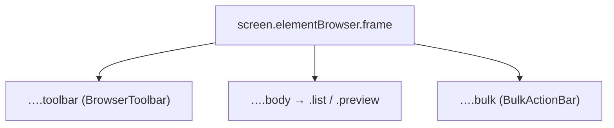

{/* ElementBrowserScreen — Narrativ-Wahrheit. Norm: docs/doc-mdx-Norm.md. */}
import { Meta, Canvas, ArgTypes } from '@storybook/addon-docs/blocks'
import * as Stories from './ElementBrowserScreen.stories.jsx'

<Meta of={Stories} />

# ElementBrowserScreen

`status:review` · Screen · Cluster `05 SCREENS/ElementBrowser`

## Kurzbeschreibung

Generischer Listen-Screen (Spec §1–§3): Drei-Zonen-Layout aus `BrowserToolbar`
(oben), `ElementList` + `ListItemPreview` (Mitte, Push) und `BulkActionBar` (unten,
fixiert). Basis für Backlog- und SprintReview-Screen — dieselbe Hülle, andere
Default-Filter.

## Zweck

Komponiert die Bausteine + den wiederverwendeten `FilterMenu` zum Strangler-
Kandidaten. Presentational: alle Daten + Callbacks als Props. Die Connected-
Variante (`useElementBrowser` + MSW) hält State und Roundtrips und reicht hier nur
Props/Callbacks durch — kein Fetch im Screen.

## Wann verwenden

- **Ja:** Listenansicht von Meilensteinen/Sprints/Issues eines Projekts.
- **Nein:** Kanban/Board → eigener Screen. Einzeldetail → Detail-Screen direkt.

## Props

<ArgTypes of={Stories} />

## Zustände

Story-Plan (Spec §9) — presentational:

<Canvas of={Stories.Default} />
<Canvas of={Stories.WithOpenPanel} />
<Canvas of={Stories.NestedMixed} />
<Canvas of={Stories.BulkSelection} />
<Canvas of={Stories.EmptyProject} />
<Canvas of={Stories.NoFilterMatch} />
<Canvas of={Stories.CompactPanel} />

`Interactive` ist presentational mit lokalem State — zum Durchspielen der
Tastatur-Kette ohne Backend (Liste fokussieren → Pfeil/Shift+Pfeil/Space/Enter →
Esc → Tab in die BulkActionBar):

<Canvas of={Stories.Interactive} />

## Connected (Daten-Integration)

`Connected` beweist die Prod-Verdrahtung end-to-end: `useElementBrowser`
(`src/hooks`) fetcht echte Endpunkte, MSW (`ElementBrowser.handlers.js`) antwortet
aus den Fixtures (`foundations/fixtures/backlog-list.json` + `sprint-list.json`),
und der Adapter (`src/lib/elementsApi.js`) mappt API-Rows → presentational Props.
Die `play`-Function assertet zwei Roundtrips (Ebene-2): Load (`GET /api/backlog`)
und Bulk (`PATCH /api/backlog/bulk` → `{ action:'cancel', ids:[…] }`).

<Canvas of={Stories.Connected} />

Beim echten Promote ersetzt der Connected-Wrapper den `ConnectedElementBrowser`
1:1 und wird in `src/screens/_shell/routes.jsx` von einem Platzhalter auf den
Screen gebogen (Strangler-Schritt 2) — die Komponenten hier ändern sich nicht.

## Barrierefreiheit

### ARIA
Drei klar getrennte Landmark-Zonen (Toolbar / Liste+Panel / Toolbar-Fuß). Die
Liste ist `role="tree"` (`aria-multiselectable`, `aria-activedescendant`), die
Preview `role="complementary"`, die BulkActionBar `role="toolbar"`.

### Keyboard
Die Tastatur-Kette ist jetzt verdrahtet (Feedback):

- **Liste** (ein Tab-Stop, APG-Tree): `↑/↓` rovet den Fokus (Ring), `Enter` öffnet
  die Preview, `Space` togglet die Zeilen-Selektion, `Shift+↑/↓` markiert eine
  Range.
- **Preview**: bekommt beim Öffnen den Fokus → `Esc` schließt sofort (auch der
  Screen-Frame fängt `Esc` ab, falls der Fokus noch in der Liste steht).
- **BulkActionBar**: nach dem Markieren per `Tab`/`Shift+Tab` erreichbar;
  `Enter`/`Space` öffnet das Aktionsmenü, `↑/↓` rovet die Optionen, `Esc` schließt.

Der Roving-Fokus + die Range-Mathematik liegen pur in
`organisms/base/listNavigation.js` (node-getestet, `tests/elementbrowser-keyboard/`);
`useListNavigation` verdrahtet sie an die DOM-Events.

## Abhängigkeiten (Komposition)

{/* AUTOGEN:composition START */}

```mermaid
graph TD
  AttachmentWidget --> FileItem
  AttachmentWidget --> IconButton
  AttachmentWidget --> WidgetBase
  BrowserToolbar --> Button
  BrowserToolbar --> Chip
  BrowserToolbar --> Input
  BrowserToolbar --> SegmentedControl
  ChecklistWidget --> Checkbox
  ChecklistWidget --> IconButton
  ChecklistWidget --> ListItem
  ChecklistWidget --> WidgetBase
  ChildWidget --> EntityId
  ChildWidget --> IconButton
  ChildWidget --> ListItem
  ChildWidget --> StatusDot
  ChildWidget --> WidgetBase
  DetailLayout --> PageTitle
  ElementBrowserScreen --> BrowserToolbar
  ElementBrowserScreen --> BulkActionBar
  ElementBrowserScreen --> ElementList
  ElementBrowserScreen --> FilterMenu
  ElementBrowserScreen --> ListItemPreview
  ElementList --> ElementRow
  ElementList --> EmptyState
  ElementList --> useListNavigation
  ElementRow --> Checkbox
  ElementRow --> EntityId
  EmptyState --> Button
  FileItem --> IconButton
  FilterMenu --> Button
  FilterMenu --> Checkbox
  FilterMenu --> Chip
  IssueDetails --> AttachmentWidget
  IssueDetails --> ChecklistWidget
  IssueDetails --> DetailLayout
  IssueDetails --> TextWidget
  ListItemPreview --> IssueDetails
  ListItemPreview --> MilestoneDetails
  ListItemPreview --> SprintDetails
  MilestoneDetails --> ChecklistWidget
  MilestoneDetails --> ChildWidget
  MilestoneDetails --> DetailLayout
  MilestoneDetails --> TextWidget
  PageTitle --> EntityId
  PageTitle --> StatusDot
  SprintDetails --> ChildWidget
  SprintDetails --> DetailLayout
  SprintDetails --> TextWidget
  TextWidget --> IconButton
  TextWidget --> Section
  TextWidget --> WidgetBase
  useListNavigation --> listNavigation
  classDef screen fill:#cba6f7,stroke:#1e1e2e,color:#1e1e2e
  classDef organism fill:#89b4fa,stroke:#1e1e2e,color:#1e1e2e
  classDef molecule fill:#a6e3a1,stroke:#1e1e2e,color:#1e1e2e
  classDef atom fill:#f2cdcd,stroke:#1e1e2e,color:#1e1e2e
  class DetailLayout,ElementBrowserScreen,IssueDetails,MilestoneDetails,SprintDetails screen
  class AttachmentWidget,BrowserToolbar,BulkActionBar,ChecklistWidget,ChildWidget,ElementList,FilterMenu,ListItemPreview,PageTitle,TextWidget,listNavigation,useListNavigation organism
  class ElementRow,FileItem,ListItem,Section,WidgetBase molecule
  class Button,Checkbox,Chip,EmptyState,EntityId,IconButton,Input,SegmentedControl,StatusDot atom
```

{/* AUTOGEN:composition END */}

## data-ui-Anker

