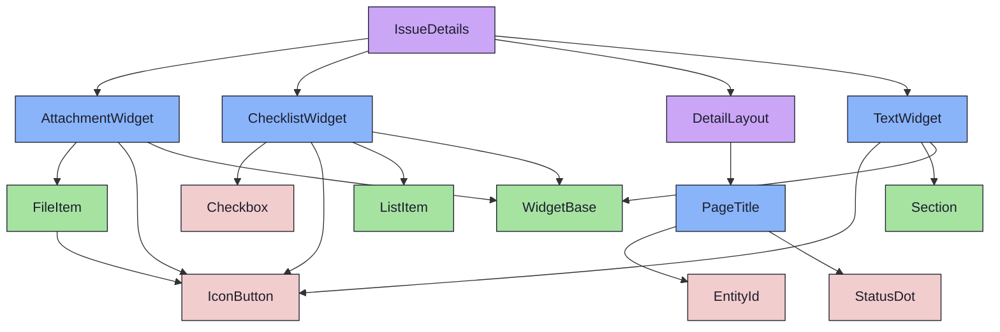
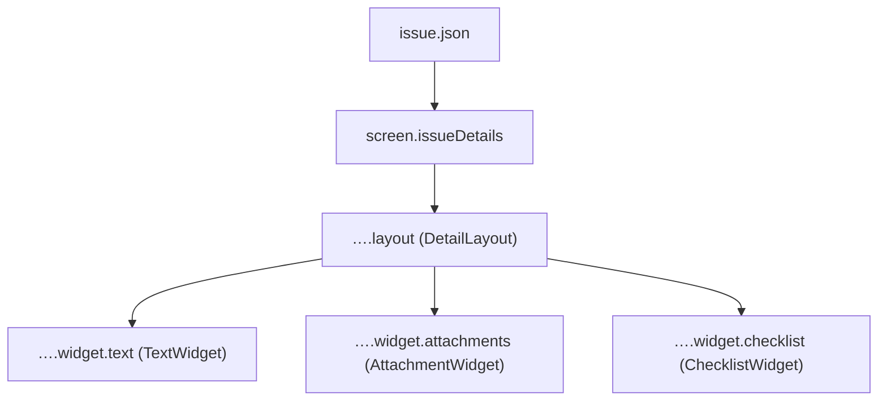
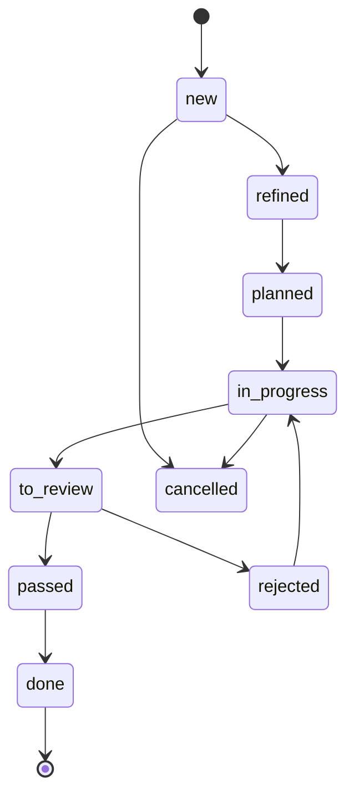

{/* IssueDetails — Narrativ-Wahrheit. Norm: docs/doc-mdx-Norm.md. */}
import { Meta, Canvas } from '@storybook/addon-docs/blocks'
import * as Stories from './IssueDetails.stories.jsx'

<Meta of={Stories} />

# IssueDetails

`status:open` · Screen · Cluster `05 SCREENS/IssueDetails`

## Kurzbeschreibung

Detail-Screen eines Issues — die erste vertikale Wahrheit der Komponenten-
Extraktion: Fixture → DetailLayout → Widgets, End-to-End.

## Zweck

Komponiert `DetailLayout` mit `TextWidget` (Beschreibung), `AttachmentWidget`
(Anhänge) und `ChecklistWidget` (Subtasks). Issues haben keine Kind-Issues →
**kein** `ChildWidget`. Presentational: nimmt das Issue als Prop (Default =
`foundations/fixtures/issue.json`), mappt Felder auf Widget-Props. Kein Live-Fetch.

## Wann verwenden

- **Ja:** Detailansicht eines Issues im Content-Bereich.
- **Nein:** Sprint/Milestone → `SprintDetails`/`MilestoneDetails` (gleiches DetailLayout).

## Zustände

`Default` rendert das (bewusst sparse) Fixture; `Populated` ein reich befülltes
Issue mit allen Widgets:

<Canvas of={Stories.Populated} />
<Canvas of={Stories.Default} />

## Aktueller Stand

### DetailLayout
- Lead-Panel + Widget-Grid.
- Wiring-Stand: verdrahtet (Fixture-Mapping in `IssueDetails.jsx`).

### Widgets
- TextWidget(goal/background/description) · AttachmentWidget(attachments) · ChecklistWidget(subtasks).
- Wiring-Stand: verdrahtet gegen Fixture-Felder; Connected-Wrapper (echter Fetch) = net-new (Promote-Loop).

## Abhängigkeiten (Komposition)

{/* AUTOGEN:composition START */}

{/* AUTOGEN:composition END */}

## data-ui-Anker

Daten-Wiring + Issue-Lifecycle (kanonisch, `lifecycle.js`):

