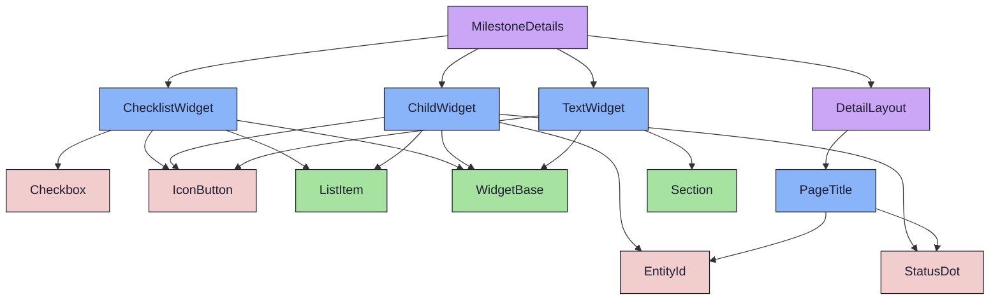
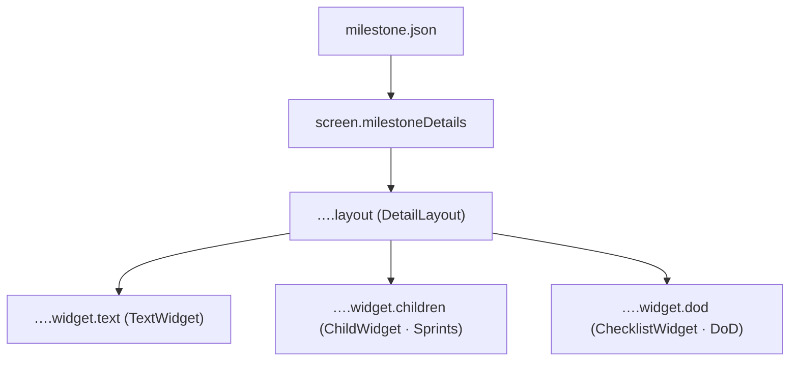

{/* MilestoneDetails — Narrativ-Wahrheit. Norm: docs/doc-mdx-Norm.md. */}
import { Meta, Canvas } from '@storybook/addon-docs/blocks'
import * as Stories from './MilestoneDetails.stories.jsx'

<Meta of={Stories} />

# MilestoneDetails

`status:open` · Screen · Cluster `05 SCREENS/MilestoneDetails`

## Kurzbeschreibung

Detail-Screen eines Milestones — dasselbe `DetailLayout`, befüllt mit
Milestone-Widgets (Beschreibung, Sprints, Definition of Done).

## Zweck

Komponiert `DetailLayout` mit `TextWidget` (Beschreibung) + `ChildWidget`
(Sprints, `kind=sprint`) + `ChecklistWidget` (DoD-Items, normalisiert auf
`{id,name,done}`). Presentational; Default = `foundations/fixtures/milestone.json`.
Da Milestones keinen kurzen Key tragen, wird ein führendes `M<n>` aus dem Namen
gezogen.

## Wann verwenden

- **Ja:** Detailansicht eines Milestones.
- **Nein:** Sprint → `SprintDetails`. Issue → `IssueDetails`.

## Zustände

<Canvas of={Stories.Populated} />
<Canvas of={Stories.Default} />

## Aktueller Stand

### DetailLayout + Widgets
- TextWidget(description) · ChildWidget(sprints) · ChecklistWidget(dod_items).
- Wiring-Stand: verdrahtet gegen Fixture; Connected-Wrapper = net-new (Promote-Loop).

## Abhängigkeiten (Komposition)

{/* AUTOGEN:composition START */}

{/* AUTOGEN:composition END */}

## data-ui-Anker

