import { Meta, Canvas, ArgTypes } from '@storybook/addon-docs/blocks'
import * as Stories from './RoadmapBoardScreen.stories.jsx'

<Meta of={Stories} />

# RoadmapBoardScreen

`status:open` · Screen · Cluster `RoadmapBoard`

## Kurzbeschreibung

Eigenständiger Screen (Projekt-Zentrale): `PageTitle`-Kopf + Steuerzeile (Suche ·
Wide-Toggle · Unassigned-Toggle · Details-Panel-Toggle · Erstellen) + `RoadmapBoard`
mit rechts angedocktem `MetaPanel`. Über die AppShell-Navigation erreichbar (kein
Sub-Detail).

## Zweck

Presentational, aber mit eigenem **UI-State**: Suchbegriff und Wide-Mode leben
hier; die Daten werden rein-funktional gefiltert (`lib/roadmapBoardFilter`) und
samt Flags/Callbacks ins Board gereicht. Kein Fetch — der Connected-Wrapper
(`src/lib` + Route in `_shell/routes`) folgt in Phase 3 (PO).

Titel über `PageTitle` (Konsistenz mit den Detail-Screens), aber **ohne Status**
(die Roadmap hat keinen Lifecycle) und mit `icon="chevron-right"` + `id`=Projekt-Slug
in Peach (`idTone="peach"`) statt farbcodiertem Entity-Key. Dazu wurde `PageTitle`
um `icon` (Iteration 2) und `idTone` (Iteration 3) erweitert, Status/EntityId-`kind`
optional. Die Meta-Zeile zeigt berechnete Stats (`gesamt · finished · wip`) über die
**gefilterten** Daten.

Steuerzeile (`items-stretch`, beide Panels gleich hoch, Row-Gap `space-4`):
`BrowserToolbar` links, **so breit wie drei MilestoneColumns**
(`w-[calc(18rem*3+var(--space-4)*2)]`) → richtet sich an den Board-Spalten aus;
Suche filtert Spalten+Sprints. Direkt rechts daneben (kein `ml-auto`) das
Actions-Panel — seine linke Kante ist damit **deckungsgleich mit der gepinnten
Unassigned-Spalte** im 2-Spalten-Board darunter (Iteration 4). Inhalt: Wide-Toggle
(`IconButton`, verdoppelt Spaltenbreite + blendet Details/Issue-Listen ein) ·
**Unassigned-Toggle** (`backlog`, blendet die Staging-Spalte ein/aus) ·
**Details-Panel-Toggle** (`info`, MetaPanel auf/zu) · `CreateActions`
(Meilenstein/Sprint/Issue, drei gleich breite Ghost-Buttons). Alle Callbacks im
Mockup Spies.

**MetaPanel-Integration (Iteration 5):** Der Board-Bereich ist eine Flex-Reihe —
links das `RoadmapBoard` (`flex-1`), rechts das angedockte `MetaPanel`. Klick auf
eine Sprint-Card (`onOpenSprint`) bzw. das ↗ einer Meilenstein-Spalte
(`onOpenMilestone`) **selektiert** die Entität ins Panel (öffnet es); das ↗ im
Panel ruft die echten Navigations-Spies (Phase 3). Panel/Unassigned-Sichtbarkeit
sind per Toolbar-Toggle steuerbar (Story-Controls `metaPanelOpen`/`showUnassigned`
setzen den Startwert, `initialSelectedKind` die Vorauswahl).

## Wann verwenden

- **Ja:** als Routen-Ziel „Roadmap" in der Shell.
- **Nein:** in eine bestehende Detail-Seite einbetten → direkt `RoadmapBoard`.

## Props

<ArgTypes of={Stories} />

## Zustände

`Default` (Fixtures, Panel zu), `WithSprintPanel`/`WithMilestonePanel` (Panel offen
mit Vorauswahl), `UnassignedHidden` (Staging-Spalte aus) und `Empty` (kein Meilenstein).

<Canvas of={Stories.Default} />
<Canvas of={Stories.WithSprintPanel} />
<Canvas of={Stories.WithMilestonePanel} />
<Canvas of={Stories.UnassignedHidden} />

## Aktueller Stand

### Titelzeile
- Rolle: `PageTitle` (Icon `chevron-right` + Peach-Slug + „Roadmap" + Stats-Meta, kein Status).
- Wiring-Stand: verdrahtet (Stats aus gefilterten Props berechnet).

### Steuerzeile
- Rolle: `BrowserToolbar` (Suche, 3-Spalten-breit) + Wide-Toggle + Unassigned-Toggle + Details-Panel-Toggle + `CreateActions`.
- Wiring-Stand: Suche/Wide/Toggles/Auswahl lokal verdrahtet; Create/Navigation als Spies (Phase 3).

### Decision-Log — Iteration 3 (9 Visual-Polish-Fixes)

| # | Entscheidung | Stand |
|---|---|---|
| I3-1 | Toolbar-Row `items-stretch` → Browser- und Actions-Panel gleich hoch; Browser zentriert seine Controls (`justify-center`) | 🟢 umgesetzt |
| I3-2 | Browser feste Breite = 3 MilestoneColumns (`calc(18rem*3+space-4*2)`), Actions `ml-auto` → Ausrichtung an Board-Spalten | 🟢 umgesetzt |
| I3-3 | Create-Buttons gleich breit (`grid grid-cols-3` + `w-full justify-center`) | 🟢 umgesetzt |
| I3-4 | `create.issue` Ghost statt Primary — alle drei gleichrangig | 🟢 umgesetzt |
| I3-5 | Issue-Liste komponiert `ListItem`-Molecule statt rohem `<li>` (+ Story `SprintIssueRow`) | 🟢 umgesetzt |
| I3-6 | Filter-Trigger `Button size="sm"` (11px) = Sort-Segmente; neuer `size`-Prop am Button-Atom | 🟢 umgesetzt |
| I3-7 | Titel-Icon `roadmap` → `chevron-right` | 🟢 umgesetzt |
| I3-8 | `title.id` in Peach — neuer `tone`-Prop an EntityId, durchgereicht via `PageTitle.idTone` | 🟢 umgesetzt |
| I3-9 | Create-Buttons `size="sm"` (11px) = Sort-Segmente | 🟢 umgesetzt |

### Decision-Log — Iteration 5 (MetaPanel-Integration)

| # | Entscheidung | Stand |
|---|---|---|
| I5-1 | `MetaPanel` rechts ans Board angedockt (Flex-Reihe: Board `flex-1` + Panel) — `MetaPanel` additiv um entity-Modus + Transition-Widget erweitert (PO: ein Bauteil, zwei Modi) | 🟢 umgesetzt |
| I5-2 | Auswahl per Klick: Card → Sprint, Column-↗ → Meilenstein selektiert ins Panel; Panel-↗ = Navigation (Spy) | 🟢 umgesetzt |
| I5-3 | Unassigned-Spalte per Toolbar-Toggle (`backlog`) ein-/ausblendbar | 🟢 umgesetzt |
| I5-4 | Details-Panel per Toolbar-Toggle (`info`) auf/zu; Story-Controls `metaPanelOpen`/`showUnassigned`/`initialSelectedKind` | 🟢 umgesetzt |
| I5-5 | Scrollbar der Meilenstein-Reihe ausgeblendet (`scrollbar-width:none` + `::-webkit-scrollbar`) + `pb` entfernt → Panel-Höhe = Spalten-Höhe (kein Mismatch durch Scrollbar) | 🟢 umgesetzt |

### Board
- Rolle: `RoadmapBoard` (gefilterte Daten + `wide` durchgereicht) im `flex-1`-Bereich, `MetaPanel` rechts angedockt.
- Wiring-Stand: Mockup (presentational); Connected-Wrapper + Route offen (Phase 3).

## Abhängigkeiten (Komposition)

{/* AUTOGEN:composition START */}

```mermaid
graph TD
  BrowserToolbar --> Button
  BrowserToolbar --> Chip
  BrowserToolbar --> Input
  BrowserToolbar --> SegmentedControl
  CreateActions --> Button
  EmptyState --> Button
  MetaPanel --> Chip
  MetaPanel --> EntityId
  MetaPanel --> IconButton
  MetaPanel --> MetaGrid
  MetaPanel --> ProgressBar
  MetaPanel --> StatusDot
  MilestoneColumn --> IconButton
  MilestoneColumn --> MilestoneColumnHeader
  MilestoneColumn --> SprintCard
  MilestoneColumnHeader --> DragHandle
  MilestoneColumnHeader --> EntityId
  MilestoneColumnHeader --> IconButton
  PageTitle --> EntityId
  PageTitle --> StatusDot
  RoadmapBoard --> EmptyState
  RoadmapBoard --> EntityId
  RoadmapBoard --> MilestoneColumn
  RoadmapBoard --> SprintCard
  RoadmapBoard --> UnassignedColumn
  RoadmapBoardScreen --> BrowserToolbar
  RoadmapBoardScreen --> CreateActions
  RoadmapBoardScreen --> IconButton
  RoadmapBoardScreen --> MetaPanel
  RoadmapBoardScreen --> PageTitle
  RoadmapBoardScreen --> RoadmapBoard
  SprintCard --> DragHandle
  SprintCard --> EntityId
  SprintCard --> IconButton
  SprintCard --> ListItem
  SprintCard --> ProgressBar
  SprintCard --> StatusDot
  UnassignedColumn --> SprintCard
  UnassignedColumn --> UnassignedColumnHeader
  UnassignedColumnHeader --> Chip
  classDef screen fill:#cba6f7,stroke:#1e1e2e,color:#1e1e2e
  classDef organism fill:#89b4fa,stroke:#1e1e2e,color:#1e1e2e
  classDef molecule fill:#a6e3a1,stroke:#1e1e2e,color:#1e1e2e
  classDef atom fill:#f2cdcd,stroke:#1e1e2e,color:#1e1e2e
  class RoadmapBoardScreen screen
  class BrowserToolbar,MetaPanel,MilestoneColumn,PageTitle,RoadmapBoard,SprintCard,UnassignedColumn organism
  class CreateActions,ListItem,MetaGrid,MilestoneColumnHeader,UnassignedColumnHeader molecule
  class Button,Chip,DragHandle,EmptyState,EntityId,IconButton,Input,ProgressBar,SegmentedControl,StatusDot atom
```

{/* AUTOGEN:composition END */}
