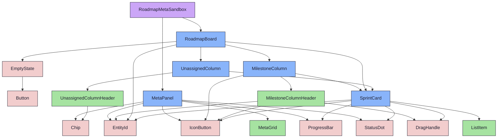

{/* RoadmapMetaSandbox — Narrativ-Wahrheit. Norm: docs/doc-mdx-Norm.md. */}
import { Meta, Canvas, ArgTypes } from '@storybook/addon-docs/blocks'
import * as Stories from './RoadmapMetaSandbox.stories.jsx'

<Meta of={Stories} />

# RoadmapMetaSandbox

`status:open` · Screen (Sandbox) · Cluster `05 SCREENS/RoadmapMetaSandbox`

## Kurzbeschreibung

Explorative Spielwiese (KEIN Prod-Screen): stellt `RoadmapBoard` neben `MetaPanel`
und macht die offenen Layout-/Panel-Forks als Controls erfahrbar. Grundlage der
PO-Entscheidung, welche Variante in den echten `RoadmapBoardScreen` promotet wird.

## Zweck

Die Idee „MetaPanel füllt den rechten Dead-Space" hat mehrere Forks (wann sichtbar,
was selektiert, ein-/ausgeklappt). Statt vorab zu entscheiden, sind sie hier args:

| Fork | Control | Werte |
| --- | --- | --- |
| Panel-Modus | `panelMode` | `on-select` (Board füllt, reflowt bei Auswahl) · `always` (Panel dauerhaft, Platzhalter ohne Auswahl) |
| Auswahl | `selected` | `none` · `sprint` · `milestone` |
| Klappen | `collapsed` | Panel ↔ Rail |

Auswahl ist im Mockup **arg-gesteuert** — die Klick→Select-Verdrahtung ins Board ist
Promote-Arbeit (Phase 2/3), nicht Teil dieser Exploration.

## Wann verwenden

- **Ja:** Varianten durchspielen, Variante für den Prod-Screen wählen.
- **Nein:** als echter Screen einbinden — dafür den gewählten Modus in
  `RoadmapBoardScreen` promoten.

## Props

<ArgTypes of={Stories} />

## Zustände

<Canvas of={Stories.FullWidth} />
<Canvas of={Stories.SprintSelected} />
<Canvas of={Stories.MilestoneSelected} />
<Canvas of={Stories.AlwaysPlaceholder} />
<Canvas of={Stories.CollapsedRail} />

## Abhängigkeiten (Komposition)

{/* AUTOGEN:composition START */}

{/* AUTOGEN:composition END */}

## data-ui-Anker

| Teil | data-ui | Zweck |
| --- | --- | --- |
| Wurzel | `screen.roadmapMetaSandbox` | Sandbox-Rahmen |
| Hinweis | `…​.note` | aktive arg-Kombination |
| Reihe | `…​.row` | Board + Panel (flex) |
| Board-Bereich | `…​.boardArea` | reflowt bei Panel |
| Board | `…​.board` | RoadmapBoard |
| Panel | `…​.panel` | MetaPanel |
