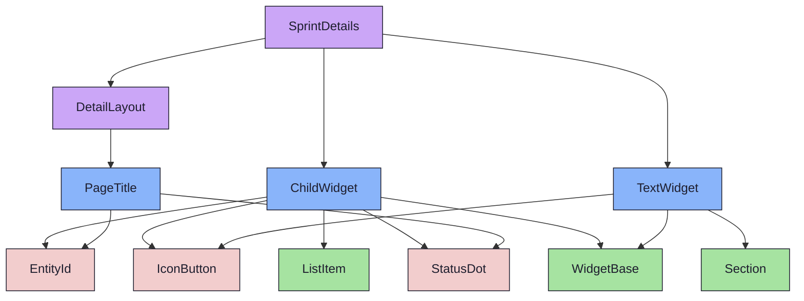
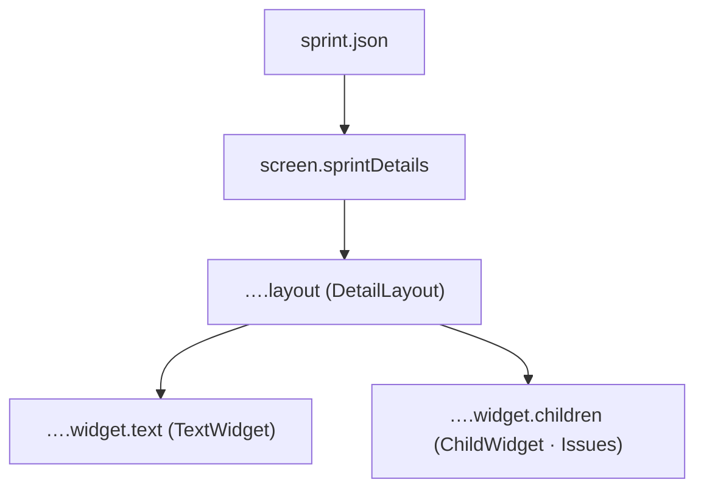

{/* SprintDetails — Narrativ-Wahrheit. Norm: docs/doc-mdx-Norm.md. */}
import { Meta, Canvas } from '@storybook/addon-docs/blocks'
import * as Stories from './SprintDetails.stories.jsx'

<Meta of={Stories} />

# SprintDetails

`status:open` · Screen · Cluster `05 SCREENS/SprintDetails`

## Kurzbeschreibung

Detail-Screen eines Sprints — dasselbe `DetailLayout` wie IssueDetails, befüllt
mit Sprint-Widgets.

## Zweck

Komponiert `DetailLayout` mit `TextWidget` (Goal/Notes) + `ChildWidget` (Issues
des Sprints). Presentational; Default = `foundations/fixtures/sprint.json`. Zeigt,
dass das geteilte Layout ohne neuen Code für eine zweite Entität trägt.

## Wann verwenden

- **Ja:** Detailansicht eines Sprints.
- **Nein:** Issue → `IssueDetails`. Milestone → `MilestoneDetails`.

## Zustände

<Canvas of={Stories.Populated} />
<Canvas of={Stories.Default} />

## Aktueller Stand

### DetailLayout + Widgets
- TextWidget(goal/notes) · ChildWidget(items=Issues, kind=issue).
- Wiring-Stand: verdrahtet gegen Fixture; Connected-Wrapper = net-new (Promote-Loop).

## Abhängigkeiten (Komposition)

{/* AUTOGEN:composition START */}

{/* AUTOGEN:composition END */}

## data-ui-Anker

